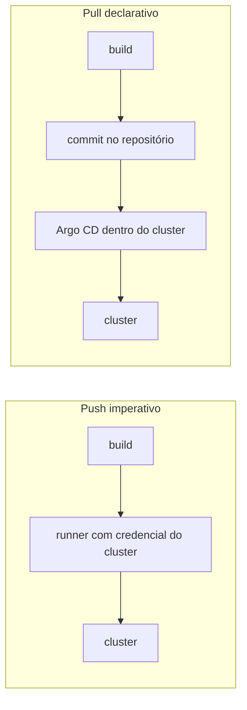
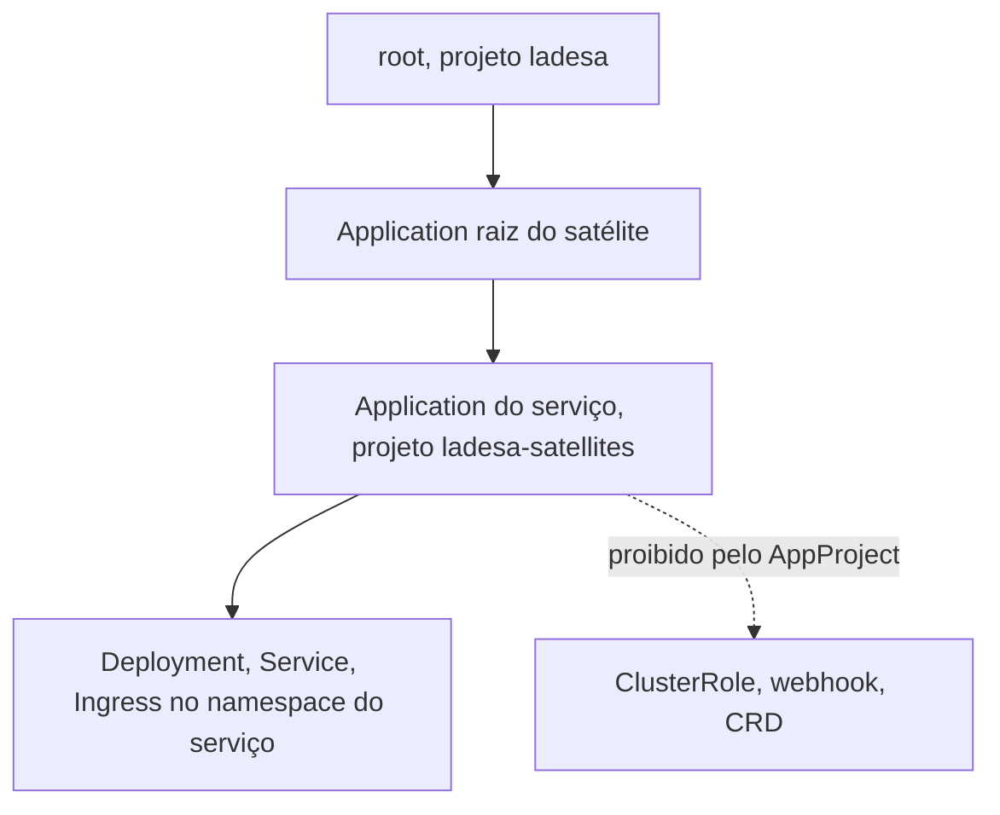

# Repositórios satélite

Os serviços da organização não moram neste repositório. Cada um tem o seu, com o próprio código e o próprio ciclo de release. Esta página descreve como um serviço desses passa a ser implantado pelo [Argo CD](../aprender/argocd.md) em vez de por comando imperativo no fim do build, e onde fica a fronteira entre os dois lados.

## O problema que o padrão resolve

Até então cada repositório satélite terminava o build chamando `helm upgrade` contra o cluster, a partir de um runner auto-hospedado dentro da própria VM de produção. Isso tem três consequências que só aparecem com o tempo.

A configuração de produção não fica necessariamente no git. Num dos casos ela vivia numa variável de ambiente do GitHub, editável pela interface, sem revisão e sem histórico, o que significa que ninguém consegue responder "o que mudou desde a semana passada" olhando para um repositório.

Não existe reconciliação. Se alguém alterar o recurso à mão no cluster, nada corrige, porque a esteira só age quando há um push.

E o runner precisa de credencial de escrita no cluster, permanentemente, para um trabalho que acontece poucas vezes por semana.

## As três camadas

| Onde | O quê |
|---|---|
| `argocd/applications/satellites/` neste repositório | uma `Application` raiz por serviço, apontando pro repositório dele com `directory: recurse: true` |
| `gitops/envs/<ambiente>/applications/` no satélite | a `Application` de verdade, que declara o que o Argo CD observa e com que política |
| `gitops/apps/<serviço>/` no satélite | o chart Helm local, com `stakater/application` como dependência vendorizada e um arquivo de values por ambiente |

A `Application` raiz é descoberta sozinha, porque o `root` já varre `argocd/applications` recursivamente. Nada precisa ser aplicado à mão depois do primeiro bootstrap.

A separação entre as duas camadas do satélite é deliberada. `envs/` responde o que observar e com que política de sincronização, que é decisão de plataforma. `apps/` responde como o serviço é montado, que é decisão de quem mantém o serviço. As duas mudam por motivos diferentes e em ritmos diferentes.

## A fronteira de posse

Este repositório decide **quais** repositórios são observados e sob qual `AppProject`. O repositório satélite decide **o que** roda dentro do espaço que recebeu.

Isso importa porque os dois `AppProject` existem justamente para limitar o alcance. O projeto `ladesa-satellites` não permite nenhum recurso cluster-wide além de `Namespace`, enquanto o projeto `ladesa`, usado pela foundation, permite `ClusterRole` e webhook de admissão porque os operadores precisam. Um commit num repositório de serviço não deve conseguir conceder privilégio de cluster a si mesmo, e é o `AppProject` que garante isso, não a boa vontade de quem revisa.

## Adoção de serviço que já roda

Um serviço migrado não é implantado do zero, ele já está no ar, normalmente como release Helm. O Argo CD passa a ser dono de recursos que já existem, e isso só é seguro se o chart declarado renderizar exatamente o que está rodando.

Por isso a migração segue o [gate de drift zero](gate-de-drift-zero.md): a `Application` nasce sem bloco `automated`, e o `automated` só é ligado depois que `argocd app diff` sai vazio. Diff vazio prova que a adoção reproduz o estado. Qualquer melhoria pretendida, como acrescentar TLS a um `Ingress` que não tinha, entra num passo seguinte, para que ninguém confunda "o chart mudou o que roda" com "o chart não reproduz o que roda".

O rastreio de posse do Argo CD neste cluster usa a chave `argocd.argoproj.io/instance`, e não `app.kubernetes.io/instance`. Isso é o que permite adotar um release Helm sem disputar o label que o próprio chart já escreve.

O release Helm antigo não desaparece sozinho. O Secret de release fica órfão no namespace depois da adoção, e sai junto da variável de ambiente que guardava os values, como parte da limpeza.
