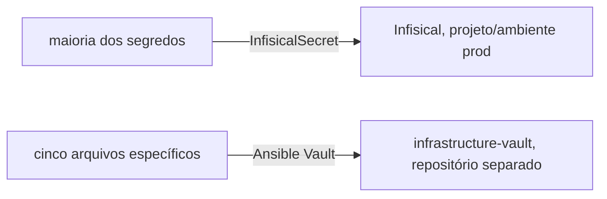
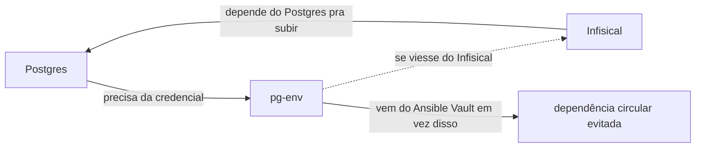

# Segredos

**TLDR**: a maioria dos segredos passa pelo Infisical; cinco arquivos ficam fora desse caminho, cifrados com Ansible Vault num repositório separado, porque autenticam o próprio Infisical ou quebrariam uma dependência circular se viessem dele.

A maioria dos segredos de aplicação, senha de banco, token de app e assim por diante, passa pelo [Infisical](../aprender/infisical.md) e chega ao cluster via recursos [`InfisicalSecret`](../aprender/infisical.md#como-funciona-dentro-de-um-cluster-kubernetes) (ver os arquivos `infisicalsecret-*.yaml` em `argocd/foundation`). Cada um aponta pro projeto correspondente no Infisical, ambiente `prod`. A identidade de máquina que autentica esses recursos (`universal-auth-credentials`) precisa ter acesso de leitura concedido em cada projeto novo, isso é feito pela própria UI do Infisical, não por este repositório.



Cinco arquivos ficam fora desse caminho, cifrados com [Ansible Vault](../aprender/ansible.md#ansible-vault), num repositório separado, [`infrastructure-vault`](https://github.com/ladesa-ro/infrastructure-vault), pra não misturar segredo, nem cifrado, com o resto deste repositório. Os quatro manifestos Kubernetes ficam em `secrets/k8s/<namespace>/`, um por namespace de destino; `k3s-token`, que não é um manifesto Kubernetes, fica em `secrets/node/`. O role [`vault-repo`](roles/vault-repo.md) clona esse repositório no node, em `/opt/infrastructure-vault`, e é de lá que o [`argocd-bootstrap`](roles/argocd-bootstrap.md) lê os quatro manifestos:

`secrets/k8s/default/universal-auth-credentials.yaml`: a credencial de machine identity que o [Infisical Kubernetes Operator](../aprender/kubernetes-operators.md) usa pra se autenticar no Infisical. Não pode viver dentro do próprio Infisical, já que é o que autentica nele.

`secrets/k8s/infisical/infisical-secrets.yaml`, referenciado por `kubeSecretRef` em `foundation-infisical.yaml`: os segredos internos do próprio servidor Infisical, incluindo `DB_CONNECTION_URI` e `REDIS_URL`. Mesmo motivo: o Infisical não pode guardar os próprios segredos de bootstrap.

`secrets/k8s/dados/pg-env.yaml`: a `DB_CONNECTION_URI` de `infisical-secrets` aponta pro `db-postgres` compartilhado, então o Infisical depende do Postgres pra subir. Se `pg-env` viesse de um `InfisicalSecret`, seria uma dependência circular: o Postgres não sobe sem a credencial, a credencial não chega sem o Infisical, o Infisical não sobe sem o Postgres. O projeto `foundation-postgres-fw7-t`, criado no Infisical antes dessa correção, foi apagado por ficar sem uso.



`secrets/k8s/redis-server/redis-secret.yaml`: mesmo motivo do `pg-env`. `REDIS_URL` em `infisical-secrets` aponta pro Redis compartilhado, não pra um Redis embutido no chart do Infisical (os values capturados têm `redis.enabled: false`). O projeto `foundation-redis-nkal`, criado antes dessa correção, também foi apagado.

`secrets/node/k3s-token`, de natureza diferente dos outros quatro: não é um `Secret` do Kubernetes, é o conteúdo cru de `/var/lib/rancher/k3s/server/token` no node, cifrado com `ansible-vault encrypt --output`. Guardado só como registro pra disaster recovery (é o que permitiria um segundo node se juntar a este cluster no futuro), não é reconciliado automaticamente por nenhuma task, já que sobrescrever o token de um node que já está rodando com ele não tem propósito.

Os quatro primeiros foram capturados direto do cluster já rodando com `scripts/create-from-cluster`, dentro do `infrastructure-vault`, que busca o `Secret` e o `Namespace`, limpa campos de runtime, e cifra o resultado com `ansible-vault`, sem nenhum passo intermediário que imprima o valor em texto puro. A senha usada foi gerada no próprio node com [`openssl rand -base64 32`](../aprender/tls-automatico.md#openssl-o-canivete-suico-manual), redirecionada direto pro arquivo, nunca exibida em tela nenhuma.

Formato de cada arquivo: um manifesto Kubernetes normal (`kind: Secret`), cifrado com `ansible-vault`, com o `Namespace` de destino bundlado como um segundo documento no mesmo arquivo, separados por `---`. Isso importa porque na primeira execução `kubectl diff` faz dry-run e pode não encontrar um namespace que ainda não existe, então o `Namespace` precisa ir junto pra a task de reconciliação (`ansible/roles/argocd_bootstrap/tasks/kubernetes-manifest-vault.yml`) aplicar os dois na mesma chamada.

Pra capturar um segredo novo do cluster no mesmo formato, dentro do clone local de `infrastructure-vault`:

```bash
export KUBECONFIG=/etc/rancher/k3s/k3s.yaml
scripts/create-from-cluster <secret> <namespace> secrets/k8s/<namespace>/<nome>.yaml /root/infrastructure-vault-pass
```

Depois, no repositório `infrastructure`, adicionar o caminho em `argocd_bootstrap_kubernetes_manifests_vault` no `host_vars/ldsa.yml`, apontando pra `{{ vault_repo_dir }}/secrets/k8s/<namespace>/<nome>.yaml`.

A senha do vault não fica em nenhum dos dois repositórios. Vive em `/root/infrastructure-vault-pass` no próprio node, `0600`, gerada com `openssl rand`, nunca commitada nem exibida. `ansible/systemd/ansible-pull.service` já referencia esse caminho via `--vault-password-file` (ver [`ansible-pull`](../aprender/ansible.md#ansible-pull-vs-push)).

## Cheatsheet: os cinco arquivos no `infrastructure-vault`

| Arquivo | Por que fica fora do Infisical |
|---|---|
| `secrets/k8s/default/universal-auth-credentials.yaml` | Autentica o próprio Infisical |
| `secrets/k8s/infisical/infisical-secrets.yaml` | Segredo de bootstrap do próprio servidor Infisical |
| `secrets/k8s/dados/pg-env.yaml` | Dependência circular com o Postgres |
| `secrets/k8s/redis-server/redis-secret.yaml` | Mesmo motivo do `pg-env` |
| `secrets/node/k3s-token` | Registro de disaster recovery, não é `Secret` do Kubernetes |
