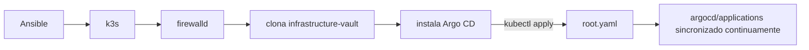
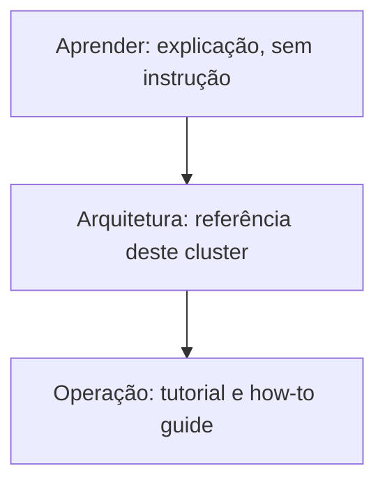

# infrastructure

Bootstrap declarativo e setup GitOps de um cluster k3s de node único. Os dados de conexão não ficam neste repositório; quem administra usa um alias próprio já configurado no `~/.ssh/config`.

O [Ansible](aprender/ansible.md) instala o [k3s](aprender/k3s.md), configura o [firewalld](aprender/firewalld.md), clona os segredos de bootstrap do [`infrastructure-vault`](https://github.com/ladesa-ro/infrastructure-vault), instala o release do [Argo CD](aprender/argocd.md), e aplica um único arquivo, o `root.yaml`. O Argo CD sincroniza tudo que descobre a partir dali, em `argocd/applications`. Nenhum segredo, em texto puro ou cifrado, fica neste repositório: todos vivem em `infrastructure-vault`.

Esta documentação está dividida em três trilhas, que se referenciam entre si mas podem ser lidas de forma independente. A divisão segue [Diátaxis](aprender/diataxis.md): cada trilha responde a um tipo diferente de necessidade, não ao mesmo assunto visto de ângulos diferentes.

## [Aprender](aprender/index.md) (explicação)

[SSH](aprender/ssh.md), [Git](aprender/git.md), [Ansible](aprender/ansible.md), [k3s](aprender/k3s.md), [firewalld](aprender/firewalld.md), [Argo CD](aprender/argocd.md): o que cada peça é e faz, de forma geral, sem depender deste cluster específico. Comece aqui se algum desses nomes não é familiar.

## [Arquitetura](arquitetura/index.md) (referência)

Como este cluster específico usa cada peça: a estrutura do repositório, o que cada role do Ansible faz e por quê, onde os segredos vivem, o que já roda hoje em produção, e os diagramas de fluxo do sistema inteiro.

## [Operação](operacao/checklist.md) (tutorial e how-to guide)

O roteiro executável: checklist, o passo a passo do bootstrap na VM, os scripts de manutenção, o que fica fora do git, e as convenções de desenvolvimento (lint, commits).
