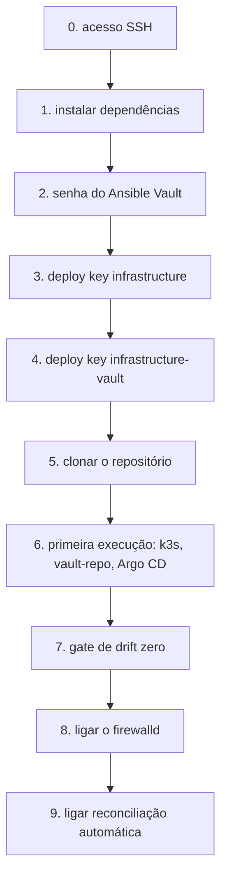
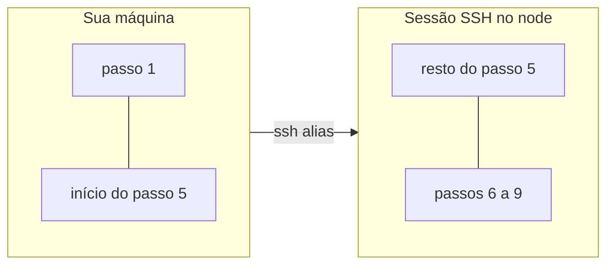
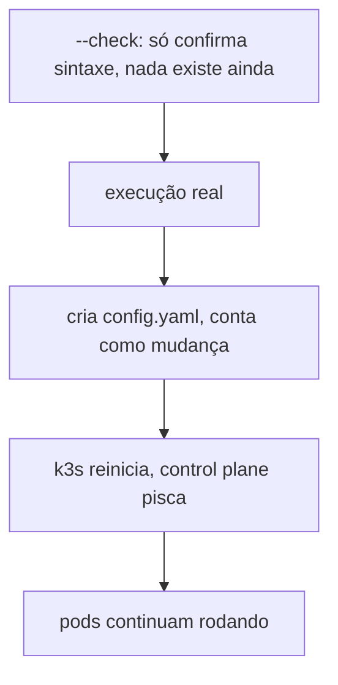

# Bootstrap mínimo na VM

**TLDR**: 9 passos, do acesso SSH até o timer de reconciliação ativo. Passos 1 e o início do 5 rodam na sua máquina; o resto roda numa sessão SSH no node. Sempre `--check` antes de rodar de verdade.

Passo a passo completo, do zero até o [Ansible](../aprender/ansible.md) e o [Argo CD](../aprender/argocd.md) assumirem sozinhos a reconciliação do que já está em `argocd/foundation`. Isso **não** inclui subir as aplicações (`web`, `docs`, `management-service`, `timetable-generator`, `authentication-service`) via Argo CD, isso depende de cada um desses repositórios ganhar sua própria pasta `gitops`, trabalho que ainda não começou em nenhum deles. Quando começar, vira sua própria documentação, não uma extensão desta.





Cada bloco de comando abaixo é pra copiar e colar, na ordem. A maioria roda direto numa sessão SSH no node; os passos 1 e a primeira parte do 5 são exceção, e rodam da sua própria máquina, marcados explicitamente onde isso muda. Todos assumem `bash` (funcionam em `zsh`/`dash`/`sh` também, a sintaxe é POSIX). Não funcionam em `fish`: usam `export VAR=valor` (em `fish` seria `set -x VAR valor`) e um laço `for ... do ... done` (em `fish` seria `for ... ; ... ; end`, com substituição de comando via `(...)` em vez de `$(...)`). Se a sessão SSH abrir num shell diferente, rodar `bash` primeiro pra entrar num subshell compatível antes de colar qualquer bloco.

## 0. Antes de tudo

Precisa de acesso SSH configurado ao node (o alias, endereço e porta reais não estão neste repositório, ver [Estado fora do git](estado-fora-do-git.md)). Sem isso nenhum dos passos abaixo é possível.

## 1. Instalar as dependências no node

Diferente do resto deste guia, este passo roda da sua própria máquina, não numa sessão SSH no node: o node ainda não tem `ansible-core`, então não dá pra usar o [`ansible-pull`](../aprender/ansible.md#ansible-pull-vs-push) pra instalar o próprio `ansible-core`. `ansible/bootstrap.yml` resolve isso via [push](../aprender/ansible.md#ansible-pull-vs-push), com `ansible.builtin.raw` (que não depende de Python já existir no destino), e de passagem já deixa `jq` (pros scripts de captura de segredo) e o CLI do `argocd` (pro [gate de drift zero](../arquitetura/gate-de-drift-zero.md) mais adiante, fixado por versão e checksum, a mesma versão que o chart do Argo CD deste repositório instala) prontos. Precisa ter `ansible-core` instalado na sua própria máquina antes de rodar isso, a partir do seu clone local deste repositório:

```bash
cd ansible
ansible-playbook -i <alias>, bootstrap.yml --tags prereqs
```

Se algum download falhar checksum, o próprio Ansible para com erro, o binário baixado não é o esperado.

## 2. Gerar a senha do [Ansible Vault](../aprender/ansible.md#ansible-vault)

Sem exibir o valor em tela nenhuma, redirecionado direto pro arquivo com [`openssl rand`](../aprender/tls-automatico.md#openssl-o-canivete-suico-manual):

```bash
umask 077
openssl rand -base64 32 > /root/infrastructure-vault-pass
chmod 600 /root/infrastructure-vault-pass
```

## 3. Gerar e registrar a [deploy key](../aprender/ssh.md#chave-pessoal-vs-deploy-key) SSH do infrastructure

O node precisa de uma chave própria, só leitura, pra clonar este repositório:

```bash
ssh-keygen -t ed25519 -f /root/.ssh/infrastructure-deploy-key -N ""
cat /root/.ssh/infrastructure-deploy-key.pub
```

Copiar a saída do último comando e adicionar em `github.com/ladesa-ro/infrastructure` → Settings → Deploy keys → Add deploy key, sem marcar "Allow write access".

## 4. Gerar e registrar a deploy key SSH do infrastructure-vault

O `infrastructure-vault` precisa da mesma coisa, com sua própria chave, separada da anterior:

```bash
ssh-keygen -t ed25519 -f /root/.ssh/infrastructure-vault-deploy-key -N ""
cat /root/.ssh/infrastructure-vault-deploy-key.pub
```

Copiar a saída do último comando e adicionar em `github.com/ladesa-ro/infrastructure-vault` → Settings → Deploy keys → Add deploy key, sem marcar "Allow write access".

## 5. Clonar o repositório no node

Só o `infrastructure`. O `infrastructure-vault` é clonado automaticamente pelo role `vault-repo`, no próximo passo, não precisa fazer isso na mão. De novo da sua própria máquina, mesmo `bootstrap.yml` do passo 1, agora com a deploy key já registrada:

```bash
ansible-playbook -i <alias>, bootstrap.yml --tags clone
```

A partir daqui, os comandos voltam a ser numa sessão SSH no node, dentro de `/opt/infrastructure`.

```bash
ssh <alias>
cd /opt/infrastructure
```

## 6. Primeira execução: [k3s](../aprender/k3s.md), vault-repo e o release do [Argo CD](../aprender/argocd.md)

Pulando o [firewalld](../aprender/firewalld.md) e o timer de propósito, os dois só entram depois. Rodar [`--check`](../aprender/ansible.md#modo-check) primeiro, ler a saída, só depois rodar de verdade.

Nesta primeira vez, `--check` não tem muito o que prever: k3s, o binário do helm e o clone do `infrastructure-vault` ainda não existem de verdade nesse node, e nada que dependa deles (release do Argo CD, diff do `root.yaml`, segredos) consegue ser conferido ainda, só confirma que a sintaxe e a ordem das tasks estão corretas. Cada role avisa isso explicitamente na saída. O `--check` volta a ser um preview de verdade a partir da segunda execução em diante.

Atenção: essa execução reinicia o k3s. O node ainda não tem `/etc/rancher/k3s/config.yaml`, o role cria esse arquivo agora, e a criação conta como mudança, então o k3s reinicia pra aplicar. É esperado, é um reinício de controle-plane real, não algo que só aparece no `--check`. Pods continuam rodando, é só o control plane que pisca.



```bash
export KUBECONFIG=/etc/rancher/k3s/k3s.yaml
ansible-playbook -i ansible/inventory/hosts.yml ansible/site.yml --skip-tags firewalld,self-pull-timer --vault-password-file /root/infrastructure-vault-pass --check
```

```bash
ansible-playbook -i ansible/inventory/hosts.yml ansible/site.yml --skip-tags firewalld,self-pull-timer --vault-password-file /root/infrastructure-vault-pass
```

## 7. Gate de drift zero

Antes de qualquer sync automático, todo `Application` precisa mostrar diff vazio contra o cluster real. O `--core` faz o `argocd` falar direto com a API do Kubernetes, sem precisar logar no servidor nem saber a senha de admin:

```bash
for app in $(kubectl get applications -n argocd -o jsonpath='{.items[*].metadata.name}'); do
  echo "=== $app ==="
  argocd app diff "$app" --core
done
```

Só segue pro próximo passo depois que isso rodar limpo, sem diff nenhum, em todas. Ver também [Gate de drift zero](../arquitetura/gate-de-drift-zero.md) pra entender por que essa regra existe.

## 8. Ligar o [firewalld](../aprender/firewalld.md)

Atenção: quem administra acessa o node por uma porta externa não-padrão, mas isso é NAT feito antes de chegar na VM. O `sshd` da própria VM escuta na porta 22 padrão (confira com `ss -tlnp | grep sshd`), e é essa porta, 22, que o firewalld precisa liberar, já comitada como default. Usar a porta externa por engano bloquearia o próprio SSH.

```bash
ansible-playbook -i ansible/inventory/hosts.yml ansible/site.yml --tags firewalld --vault-password-file /root/infrastructure-vault-pass --check
```

```bash
ansible-playbook -i ansible/inventory/hosts.yml ansible/site.yml --tags firewalld --vault-password-file /root/infrastructure-vault-pass
```

Depois de rodar, testar uma nova conexão SSH numa aba separada antes de fechar a sessão atual, pra confirmar que o acesso não quebrou.

## 9. Ligar a reconciliação automática

Só depois de tudo confirmado acima:

```bash
ansible-playbook -i ansible/inventory/hosts.yml ansible/site.yml --tags self-pull-timer --vault-password-file /root/infrastructure-vault-pass --check
```

```bash
ansible-playbook -i ansible/inventory/hosts.yml ansible/site.yml --tags self-pull-timer --vault-password-file /root/infrastructure-vault-pass
```

Confirmar que o timer ficou ativo:

```bash
systemctl status ansible-pull.timer
```

A saída precisa mostrar `active`. A partir daqui o node reaplica este repositório sozinho, num intervalo, e o Argo CD mantém tudo em `argocd/apps` sincronizado sozinho a partir da Application root. É esse o ponto real em que o Ansible e o Argo CD assumem.

## O que não está aqui

Subir `web`, `docs`, `management-service`, `timetable-generator` e `authentication-service` via Argo CD. Depende de cada repositório ganhar sua própria pasta `gitops`, ainda não começou.

## Cheatsheet: tags por passo

| Passo | Tag/flag |
|---|---|
| 1 | `--tags prereqs` (em `bootstrap.yml`) |
| 5 | `--tags clone` (em `bootstrap.yml`) |
| 6 | `--skip-tags firewalld,self-pull-timer` (em `site.yml`) |
| 8 | `--tags firewalld` |
| 9 | `--tags self-pull-timer` |
| Qualquer passo real | `--vault-password-file /root/infrastructure-vault-pass` |
| Preview antes de aplicar | `--check` |
