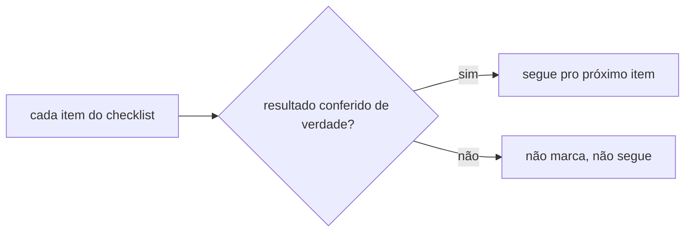
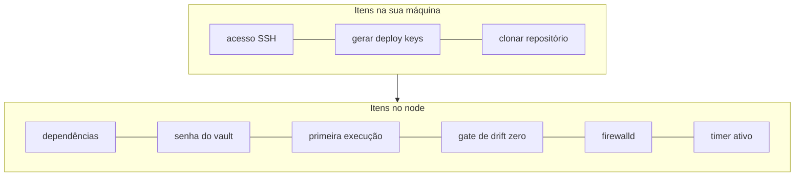

# Checklist

**TLDR**: 10 itens, na ordem do [bootstrap](bootstrap.md); não marca sem conferir de verdade; se um item falhar, não segue pro próximo.

Esta seção é **how-to guide** (este checklist) e **tutorial** ([Bootstrap mínimo na VM](bootstrap.md)), no sentido de [Diátaxis](../aprender/diataxis.md): passo a passo prático, escrito pra ser executado, não pra ser lido como explicação. Cada item corresponde a um passo em [Bootstrap mínimo na VM](bootstrap.md). Serve pra saber onde você está e o que ainda falta, não pra marcar sem conferir de verdade o resultado de cada comando.

Os 10 itens abaixo já foram concluídos e conferidos de verdade no node de produção `ldsa`, em 2026-08-21 (ver [lições do bootstrap](../arquitetura/licoes-do-bootstrap.md) pro que deu certo e o que precisou de correção no caminho). Continuam marcados como referência de que o bootstrap completo já rodou com sucesso; numa reprovisão do zero, desmarcar tudo e seguir a ordem de novo.

- [x] Acesso SSH ao node configurado (`~/.ssh/config`, alias próprio) (*sua máquina*): [configurar e validar](bootstrap.md#0-antes-de-tudo)
- [x] `ansible-core`, `jq` e o CLI do `argocd` instalados no node, checksum do `argocd` conferido pelo próprio Ansible (*sua máquina, via `bootstrap.yml`*): [configurar e validar](bootstrap.md#1-instalar-as-dependencias-no-node)
- [x] Senha do [Ansible Vault](../aprender/ansible.md#ansible-vault) gerada em `/root/infrastructure-vault-pass` (*node, via SSH*): [configurar e validar](bootstrap.md#2-gerar-a-senha-do-ansible-vault)
- [x] [Deploy key](../aprender/ssh.md#chave-pessoal-vs-deploy-key) SSH do `infrastructure` gerada (*node, via SSH*): [configurar e validar](bootstrap.md#3-gerar-e-registrar-a-deploy-key-ssh-do-infrastructure)
- [x] Deploy key do `infrastructure` registrada como leitura em `github.com/ladesa-ro/infrastructure` (*GitHub, no navegador*): [configurar e validar](bootstrap.md#3-gerar-e-registrar-a-deploy-key-ssh-do-infrastructure)
- [x] Deploy key SSH do `infrastructure-vault` gerada e registrada como leitura em `github.com/ladesa-ro/infrastructure-vault` (*node, via SSH* e *GitHub, no navegador*): [configurar e validar](bootstrap.md#4-gerar-e-registrar-a-deploy-key-ssh-do-infrastructure-vault)
- [x] Repositório `infrastructure` clonado no node com sua deploy key (*sua máquina, via `bootstrap.yml`*): [configurar e validar](bootstrap.md#5-clonar-o-repositorio-no-node)
- [x] Primeira execução (`k3s` + `vault-repo` + `argocd-bootstrap`) rodada com `--check` e depois de verdade, sem erro (*node, via SSH*): [configurar e validar](bootstrap.md#6-primeira-execucao-k3s-vault-repo-e-o-release-do-argo-cd)
- [x] [Gate de drift zero](../arquitetura/gate-de-drift-zero.md): `argocd app diff --core` vazio em **todas** as Applications, não só nas óbvias (*node, via SSH*): [configurar e validar](bootstrap.md#7-gate-de-drift-zero)
- [x] Firewalld ligado, e uma segunda conexão SSH testada com sucesso antes de fechar a primeira (*a segunda conexão é da sua máquina, o resto é no node*): [configurar e validar](bootstrap.md#8-ligar-o-firewalld)
- [x] Timer do `ansible-pull` habilitado (`systemctl status ansible-pull.timer` mostra `active`) (*node, via SSH*): [configurar e validar](bootstrap.md#9-ligar-a-reconciliacao-automatica)

Se algum item não estiver limpo, não segue pro próximo. É a mesma regra do [gate de drift zero](../arquitetura/gate-de-drift-zero.md), só que pro bootstrap inteiro.

