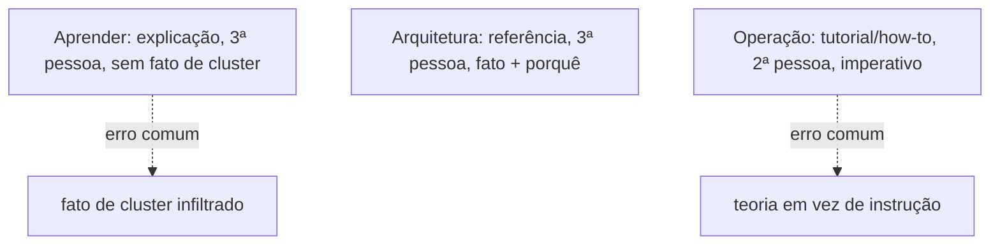
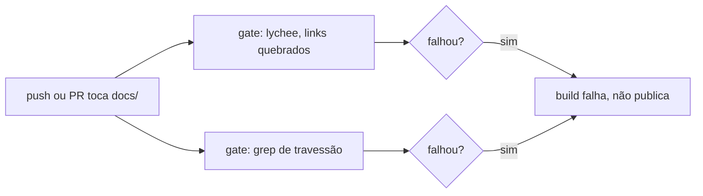

# Desenvolvimento

**TLDR**: três modos, três vozes (Aprender impessoal, Arquitetura fatual, Operação imperativa); linha editorial adaptada de oito style guides externos; dois gates de CI (lychee + travessão); commits Conventional Commits só no título.

| Termo | Vá pra |
|---|---|
| Modo e voz por seção | [Estrutura de conteúdo](#estrutura-de-conteudo-modo-e-voz-por-secao) |
| Regras de redação adotadas | [Linha editorial](#linha-editorial) |
| Lint de Ansible/YAML | [Lint](#lint) |
| Gates de CI da documentação | [Qualidade da documentação](#qualidade-da-documentacao) |
| Convenção de commit | [Commits](#commits) |

## Estrutura de conteúdo: modo e voz por seção

As três trilhas ([Aprender](../aprender/index.md), [Arquitetura](../arquitetura/index.md), [Operação](checklist.md)) seguem [Diátaxis](../aprender/diataxis.md), não são só uma divisão temática. Cada seção corresponde a um modo diferente, e o modo determina tanto o que entra em cada página quanto a voz usada pra escrever ela:

**Aprender é explicação**: terceira pessoa, impessoal ("um Operator é", não "você vai usar um Operator"), sem instrução nenhuma ("faça X"), sem fato específico de um cluster real (ver a regra completa em [Referências](../aprender/referencias.md) e no restante da seção). O teste rápido: se a frase começa a soar como comando ou como "isto aqui, especificamente, faz assim", ela não pertence ao Aprender.

**Arquitetura é referência**: fato sobre este cluster específico, organizado pra consulta rápida, com o porquê de cada decisão registrado ao lado do fato (não uma explicação de conceito geral, isso já está no Aprender, só o raciocínio da escolha feita aqui). Terceira pessoa também, mas fatual, não instrucional.

**Operação é tutorial e how-to guide**: segunda pessoa, voz ativa, modo imperativo ("copie a chave", "rode o comando"), assumindo que quem lê já sabe o básico (isso está no Aprender) e só precisa do passo concreto. `bootstrap.md`, guiado do início ao fim pra quem nunca fez, é mais tutorial; `checklist.md`, pra quem já sabe e só quer confirmar onde parou, é mais how-to guide.

Misturar um modo com outro é o erro mais comum que Diátaxis nomeia: uma página do Aprender que menciona um fato real deste cluster, ou uma página de Operação que para pra explicar teoria em vez de instruir, confunde as duas pessoas que estavam lendo por motivos diferentes.



## Linha editorial

Além da estrutura por modo acima, as regras de redação abaixo vêm de ler os style guides de documentação técnica mais citados do mercado: [Google](https://developers.google.com/style/), [Microsoft](https://learn.microsoft.com/en-us/style-guide/welcome/), [GitHub](https://docs.github.com/en/contributing/style-guide-and-content-model/style-guide), [GitLab](https://docs.gitlab.com/development/documentation/styleguide/), [Red Hat](https://redhat-documentation.github.io/supplementary-style-guide/), [MDN](https://developer.mozilla.org/en-US/docs/MDN/Writing_guidelines) e [Docker](https://github.com/docker/docs/blob/main/CONTRIBUTING.md), além da [documentação da Stripe](https://docs.stripe.com) como referência de organização e experiência de leitura, não de regra de redação. Nem toda regra desses guias se aplica aqui, cada um foi escrito pro contexto de quem o mantém; o que segue é o subconjunto que fez sentido adotar.

**Adotado:**

- Título em sentence case, nunca Title Case (convenção comum a Google, GitHub, GitLab e Docker), já natural em português, onde Title Case nem é gramatical.
- Sem travessão em texto corrido, regra já em vigor aqui e reforçada pelo próprio guia do GitLab, que proíbe o mesmo caractere pelo mesmo motivo, poluição visual sem ganho de clareza.
- Texto de link sempre descritivo (`ver [Argo CD](argocd.md)`), nunca genérico (`clique aqui`), regra idêntica em Google e GitLab.
- Sem linguagem de marketing nem superlativo não verificável ("a melhor ferramenta", "simplesmente resolve tudo"): toda comparação entre ferramentas nesta doc vem acompanhada do trade-off real, não só da vantagem.
- Sem autorreferência de preenchimento ("esta página explica", "neste guia vamos ver"), regra explícita do GitLab. A frase de modo Diátaxis que abre cada seção (ver acima) é a exceção deliberada: não é preenchimento, é sinalização estrutural do que o leitor está prestes a ler.
- Título de procedimento no imperativo, não no gerúndio ("Instalar as dependências", não "Instalando as dependências"), regra do Red Hat, já seguida em `bootstrap.md`.
- Um comando por bloco de código quando o passo precisa ser copiado isoladamente, regra do Red Hat, já seguida em `bootstrap.md`.
- Valor que quem lê precisa substituir sempre em `<algo>`, nunca em texto solto sem marcação.

**Considerado e descartado:**

- Proibição de ponto e vírgula, regra explícita do GitLab. Não adotada aqui: conflita com o estilo de prosa densa já estabelecido nesta doc, em português o ponto e vírgula une duas orações relacionadas sem quebrar o parágrafo em frases curtas demais, o oposto do que a maioria desses guias otimiza (escritos em inglês, pra um estilo mais fatiado em lista).
- Uso de contração como sinal de tom amigável, regra de Microsoft e GitLab. Não se aplica: contração é um mecanismo do inglês (`don't`, `it's`) sem equivalente direto em português.

## Lint

`.yamllint` e `.ansible-lint` na raiz. `ansible-lint` ignora `argocd/` (não é Ansible). Rodar com `yamllint .` e `ansible-lint` antes de propor mudança.

## Qualidade da documentação

O workflow `quality.yml` roda em todo push e PR que toca `docs/` ou o `README.md`, com dois gates: [lychee](https://lychee.cli.rs) checa todo link externo e interno das páginas (configurado em `.lychee.toml`, aceitando `403`/`429` como respostas válidas de bot-blocking, não link quebrado de verdade), e um segundo job falha se encontrar o caractere de travessão em qualquer arquivo `.md`, a regra de estilo deste repositório (ver [Referências](../aprender/referencias.md) e o restante da seção Aprender pra exemplo do tom esperado). O princípio por trás dos dois gates é o mesmo que a [documentação da Stripe](https://docs.stripe.com), citada como referência de qualidade em documentação de API, aplica: link quebrado ou inconsistência de estilo falha o build, não aparece publicado pra quem lê. Rodar localmente antes de propor mudança grande:



```bash
docker run --rm -v "$PWD":/docs -w /docs lycheeverse/lychee --config .lychee.toml 'docs/**/*.md' 'README.md'
```

## Commits

Os commits aqui seguem [Conventional Commits](../aprender/git.md#conventional-commits) só no título, `type(scope): subject`. Sem corpo, sem Co-Authored-By.
