# Desenvolvimento

**TLDR**: três modos, três vozes (Aprender impessoal, Arquitetura fatual, Operação imperativa). Linha editorial consolidada de sete style guides externos mais a ISO 24495-1 de linguagem clara, com a regra exata de cada um, não só o link. Zero comentário em código, enforçado por `ast-grep`. Dois gates de CI da documentação (lychee + travessão), dez checks de código e infraestrutura não bloqueantes rodando numa imagem thin com hermit, e dois gates de segurança (gitleaks bloqueante, trivy consultivo). Commits Conventional Commits só no título, enforçado por `commit-lint.yml`.

| Termo | Vá pra |
|---|---|
| Modo e voz por seção | [Estrutura de conteúdo](#estrutura-de-conteudo-modo-e-voz-por-secao) |
| Regras de redação adotadas | [Linha editorial](#linha-editorial) |
| Por que nenhum arquivo de código tem comentário | [Comentários em código](#comentarios-em-codigo) |
| Lint de Ansible/YAML | [Lint](#lint) |
| Gates de CI da documentação | [Qualidade da documentação](#qualidade-da-documentacao) |
| Duplicação, schema, shellcheck e lint dos próprios workflows | [Qualidade de código e infraestrutura](#qualidade-de-codigo-e-infraestrutura) |
| Quando vale testar um role contra um sistema real, não só lint | [Testar um role com Molecule](#testar-um-role-com-molecule) |
| Secret scanning e misconfig de IaC | [Segurança](#seguranca) |
| Por que todo afrouxamento de gate vira registro | [Bypass e afrouxamento de CI](#bypass-e-afrouxamento-de-ci) |
| Licença de cada ferramenta usada em CI | [Licenças das ferramentas de CI](#licencas-das-ferramentas-de-ci) |
| CODEOWNERS e cooldown do Dependabot | [Donos de código e atualização de dependências](#donos-de-codigo-e-atualizacao-de-dependencias) |
| Convenção de commit | [Commits](#commits) |

## Estrutura de conteúdo: modo e voz por seção

As três trilhas ([Aprender](../aprender/index.md), [Arquitetura](../arquitetura/index.md), [Operação](checklist.md)) seguem [Diátaxis](../aprender/diataxis.md), não são só uma divisão temática. Cada seção corresponde a um modo diferente, e o modo determina tanto o que entra em cada página quanto a voz usada pra escrever ela:

**Aprender é explicação**: terceira pessoa, impessoal ("um Operator é", não "você vai usar um Operator"), sem instrução nenhuma ("faça X"), sem fato específico de um cluster real (ver a regra completa em [Referências](../aprender/referencias.md) e no restante da seção). O teste rápido: se a frase começa a soar como comando ou como "isto aqui, especificamente, faz assim", ela não pertence ao Aprender.

**Arquitetura é referência**: fato sobre este cluster específico, organizado pra consulta rápida, com o porquê de cada decisão registrado ao lado do fato (não uma explicação de conceito geral, isso já está no Aprender, só o raciocínio da escolha feita aqui). Terceira pessoa também, mas fatual, não instrucional.

**Operação é tutorial e how-to guide**: segunda pessoa, voz ativa, modo imperativo ("copie a chave", "rode o comando"), assumindo que quem lê já sabe o básico (isso está no Aprender) e só precisa do passo concreto. `bootstrap.md`, guiado do início ao fim pra quem nunca fez, é mais tutorial. `checklist.md`, pra quem já sabe e só quer confirmar onde parou, é mais how-to guide.

Misturar um modo com outro é o erro mais comum que Diátaxis nomeia: uma página do Aprender que menciona um fato real deste cluster, ou uma página de Operação que para pra explicar teoria em vez de instruir, confunde as duas pessoas que estavam lendo por motivos diferentes.

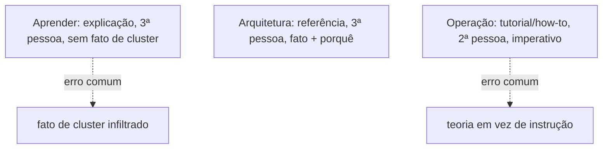

## Linha editorial

As regras de redação abaixo vêm de ler sete style guides de documentação técnica, os mais citados do mercado, mais a norma internacional de linguagem clara **ISO 24495-1** (ver [Normas de redação técnica](../aprender/normas-de-redacao-tecnica.md) pra essa e outras normas do mesmo campo, incluindo as que foram descartadas), e ficam aqui consolidadas com a regra exata de cada um, não só o link: se o guia original sair do ar ou mudar de conteúdo, esta seção continua completa por conta própria. Nem toda regra de cada guia se aplica aqui, cada um foi escrito pro contexto de quem o mantém. O que segue é o subconjunto adotado, o rejeitado, e o porquê de cada decisão.

**O que cada guia diz, na fonte:**

- **[Google Developer Documentation Style Guide](https://developers.google.com/style/)**: sentence case em título e heading, capitalizando só a primeira palavra, a primeira depois de dois-pontos, e nome próprio (página `/style/capitalization`). Link deve fazer sentido sem o texto ao redor, nunca "clique aqui" ou "este documento" (`/style/link-text`). Sobre travessão, a posição de Google é a **oposta** da adotada aqui: recomenda travessão sem espaço ao redor pra indicar quebra ou interrupção na frase (`/style/dashes`), o inverso exato da regra do GitLab abaixo.
- **[Microsoft Writing Style Guide](https://learn.microsoft.com/en-us/style-guide/welcome/)**: voz "quente e relaxada, nítida e clara", killer feature é escrever pra quem não é nativo do inglês nem especialista técnico. O guia completo (dashes, bias-free language) fica atrás de páginas específicas de terminologia que este repositório não reproduz aqui por não se aplicarem a prosa em português.
- **[GitHub Docs Style Guide](https://docs.github.com/en/contributing/style-guide-and-content-model/style-guide)**: voz ativa sempre que possível, voz passiva só quando o objeto da ação importa mais que quem age. Sentence case em heading e título. Link introduzido por frase completa ("para mais informação, veja X"), nunca embutido cru no meio da frase, e o mesmo link não deve se repetir mais de uma vez no mesmo artigo.
- **[GitLab Documentation Style Guide](https://docs.gitlab.com/development/documentation/styleguide/)**: proíbe explicitamente o caractere travessão longo e a meia-risca, "use frases separadas, ou vírgula, em vez disso", a regra adotada neste repositório. Proíbe também ponto e vírgula ("use duas frases em vez disso"). Contração é incentivada pro tom conversacional, exceto com nome próprio, pra enfatizar negativa, em documentação de referência, e em mensagem de erro. Proíbe "saiba mais sobre" e "veja a página X". Exige o formato `"para mais informação, veja [texto descritivo]"`. Sentence case em título e cabeçalho de tabela. Proíbe autorreferência de preenchimento ("esta página mostra"), pede ir direto ao ponto. Proíbe palavra que sugere facilidade ("simplesmente", "facilmente") e alegação de marketing não verificável.
- **[Red Hat Supplementary Style Guide](https://redhat-documentation.github.io/supplementary-style-guide/)**: título de procedimento no imperativo, nunca gerúndio ("Install the CLI", não "Installing the CLI"). Um comando por bloco de código por passo, saída do comando em bloco separado. Placeholder em `<nome_do_valor>`, itálico, minúsculo, `_` separando palavra composta. Sentence case em heading, alvo de 3 a 11 palavras por heading pra facilitar busca.
- **[MDN Writing Guidelines](https://developer.mozilla.org/en-US/docs/MDN/Writing_guidelines)**: tom casual, as "três Cs" (clear, concise, consistent). Contração incentivada pro tom casual. Pronome de gênero neutro, "they/them" no singular em vez de "he/she". Sentence case em heading, só primeira palavra e nome próprio capitalizados.
- **[Docker Docs Style Guide](https://github.com/docker/docs/blob/main/STYLE.md)**: vírgula de Oxford em lista. Proíbe ponto e vírgula ("escreva duas frases"). Permite travessão, com espaço em volta (posição intermediária entre Google, sem espaço, e GitLab, que proíbe). Heading de até oito palavras, sem artigo inicial, ação primeiro. Proíbe palavra de facilitação ("simplesmente", "só", "facilmente") e superlativo ("poderoso", "robusto", "revolucionário"), e meta-comentário ("vale notar que"). "Você", nunca "nós". Evita "atualmente"/"neste momento" (data a prosa).

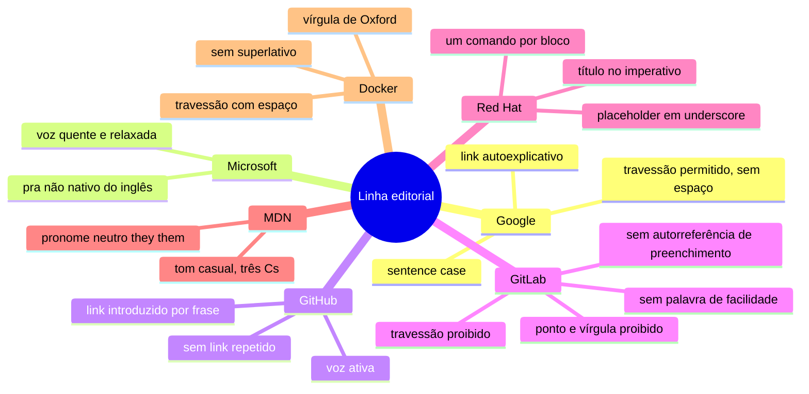

**Adotado:**

- As quatro pilastras de linguagem clara da **ISO 24495-1** (relevância, encontrabilidade, compreensão, usabilidade) como critério de fundo por trás de toda regra abaixo, não uma regra a mais: uma frase só é "clara" nesse sentido se o leitor certo a acha, entende, usa, e consegue avaliar se fez o que precisava. Nenhuma frase desta seção é auditada formalmente contra o texto da norma, o princípio é a referência, não a conformidade (ver [Princípio como inspiração, não como conformidade](../aprender/normas-de-redacao-tecnica.md#principio-como-inspiracao-nao-como-conformidade)).
- Estrutura por tarefa e análise de audiência, princípio geral da **IEC/IEEE 82079-1** (a norma de instrução de uso mais abrangente do campo), por trás da divisão em três modos já descrita em [Estrutura de conteúdo](#estrutura-de-conteudo-modo-e-voz-por-secao): Aprender pra quem não conhece o conceito, Arquitetura pra quem quer o fato, Operação pra quem vai executar o passo, a mesma lógica de "informação certa pro estágio certo de quem lê" que a norma formaliza pra manual de produto físico.
- Título em sentence case, nunca Title Case: convenção idêntica em Google, GitHub, GitLab, Red Hat, MDN e Docker (seis dos sete concordam), já natural em português, onde Title Case nem é gramatical.
- Sem travessão em texto corrido, regra do GitLab, apesar de Google recomendar o oposto e Docker permitir com espaço: poluição visual sem ganho de clareza foi o critério decisivo, não o consenso entre os guias (que não existe aqui).
- Sem ponto e vírgula, regra de GitLab e Docker: duas frases separadas em vez de uma frase composta. Revisado em 2026-08-20, depois de ter ficado do lado de "considerado e descartado" logo abaixo, quando a legibilidade de frase curta passou a valer mais que a densidade de prosa já estabelecida.
- Sem abuso de crase (`` ` ``) marcando termo como código: cada nome de arquivo, comando ou identificador continua entre crases, mas frase que vira uma sequência de termos crasados um atrás do outro deve ser reescrita, prosa não é lista de código.
- Texto de link sempre descritivo (`ver [Argo CD](argocd.md)`), nunca genérico (`clique aqui`), regra idêntica em Google, GitHub e GitLab, os três mais explícitos nisso.
- Sem linguagem de marketing nem superlativo não verificável ("a melhor ferramenta", "simplesmente resolve tudo"), regra combinada de GitLab e Docker: toda comparação entre ferramentas nesta doc vem acompanhada do trade-off real, não só da vantagem.
- Sem autorreferência de preenchimento ("esta página explica", "neste guia vamos ver"), regra explícita do GitLab. A frase de modo Diátaxis que abre cada seção (ver acima) é a exceção deliberada: não é preenchimento, é sinalização estrutural do que o leitor está prestes a ler.
- Título de procedimento no imperativo, não no gerúndio ("Instalar as dependências", não "Instalando as dependências"), regra do Red Hat, já seguida em `bootstrap.md`.
- Um comando por bloco de código quando o passo precisa ser copiado isoladamente, regra do Red Hat, já seguida em `bootstrap.md`.
- Valor que quem lê precisa substituir sempre em `<algo>`, nunca em texto solto sem marcação, mesmo princípio do placeholder do Red Hat, adaptado sem itálico forçado (Markdown puro já diferencia `` `código` `` visualmente).

**Considerado e descartado:**

- Proibição de ponto e vírgula, regra explícita de GitLab e Docker. Rejeitada na primeira versão desta seção, com o argumento de que o ponto e vírgula une duas orações relacionadas em português sem quebrar o parágrafo em frases curtas demais. Depois adotada mesmo assim (ver "Sem ponto e vírgula" em Adotado, acima), decisão editorial explícita do mantenedor, não um argumento técnico que reverteu o anterior.
- Uso de contração como sinal de tom amigável, regra de GitLab, MDN e Docker. Não se aplica: contração é um mecanismo do inglês (`don't`, `it's`) sem equivalente direto em português.
- Travessão permitido com espaço (posição do Docker) ou sem espaço (posição do Google), as duas descartadas em favor da proibição total do GitLab, único dos sete a proibir por completo.
- Numeração progressiva de seção estilo ABNT NBR 6024 (`1`, `1.1`, `1.1.2`). Não pelo motivo óbvio ("é norma acadêmica"), o escopo declarado da norma é mesmo trabalho acadêmico, mas o motivo real é conflito de ferramenta: o gerador de site desta doc já produz sumário por âncora de heading, numeração decimal manual duplicaria esse trabalho sem reforçar organização nenhuma (ver [Normas de redação técnica](../aprender/normas-de-redacao-tecnica.md) pro resto da família ABNT, nenhuma adotada pelo mesmo motivo de escopo).
- Vírgula de Oxford, regra do Docker: não existe em português (a língua não tem essa ambiguidade de lista que a vírgula de Oxford resolve em inglês).
- Heading limitado a 3-11 palavras (Red Hat) ou 8 palavras (Docker): não adotado como regra rígida, títulos desta documentação priorizam ser descritivos sobre caber num limite de palavra, mesmo quando passam de oito.

## Comentários em código

**TLDR**: zero comentário em qualquer arquivo de código deste repositório, `.yaml`, `.hcl`, `.yml` de workflow, shell script, task de Ansible, unit de systemd, tudo. Contexto que justificaria um comentário vai pra um `.md`, nunca inline.

Regra do mantenedor, não de nenhum dos sete style guides acima (que são só sobre prosa em Markdown, não sobre código): nenhum arquivo de código deste repositório leva comentário explicativo, nem `#` em YAML/HCL/shell, nem justificativa de decisão de versão, nem aviso de risco operacional embutido na task. Isso vale pra todo o inventário de formatos usado aqui: `.yml`/`.yaml` (Ansible, Argo CD, GitHub Actions), `.hcl` (Hermit, Docker Bake), `Containerfile`, shell script em `scripts/`.

Duas exceções, ambas mecânicas, não narrativas: a diretiva de supressão de linter que o próprio ansible-lint exige inline (`# noqa: regra`, quando funciona, ver [Qualidade de código e infraestrutura](#qualidade-de-codigo-e-infraestrutura) pro caso em que não funciona), e o cabeçalho de licença de arquivo vendorizado de terceiro (o `cert-manager`/`cnpg` trazem o próprio comentário de copyright, que não é deste repositório pra remover). Fora essas duas, todo contexto que pareceria justificar um comentário (por que essa versão está pinada, por que essa exclusão existe, o raciocínio por trás de uma decisão) vai pra este mesmo arquivo, pra `estrutura.md`, ou pra outra página de Arquitetura/Operação, nunca inline no código.

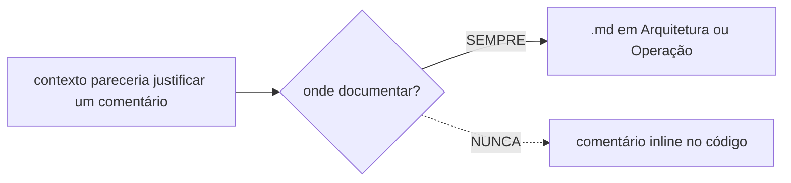

Essa regra é enforçada de verdade, não só de boa-fé, pelo check `ast-grep` de [Qualidade de código e infraestrutura](#qualidade-de-codigo-e-infraestrutura): usa o parser real de cada linguagem (`yaml`, `hcl`, `bash`) pra achar todo nó de comentário, exceto as duas exceções mecânicas acima (pragma de linter, shebang).

## Lint

**TLDR**: `.yamllint` cobre sintaxe e estilo de todo YAML do repositório, `.ansible-lint` cobre convenção específica de Ansible por cima disso, os dois rodam automaticamente desde que `codigo-e-infra` existe.

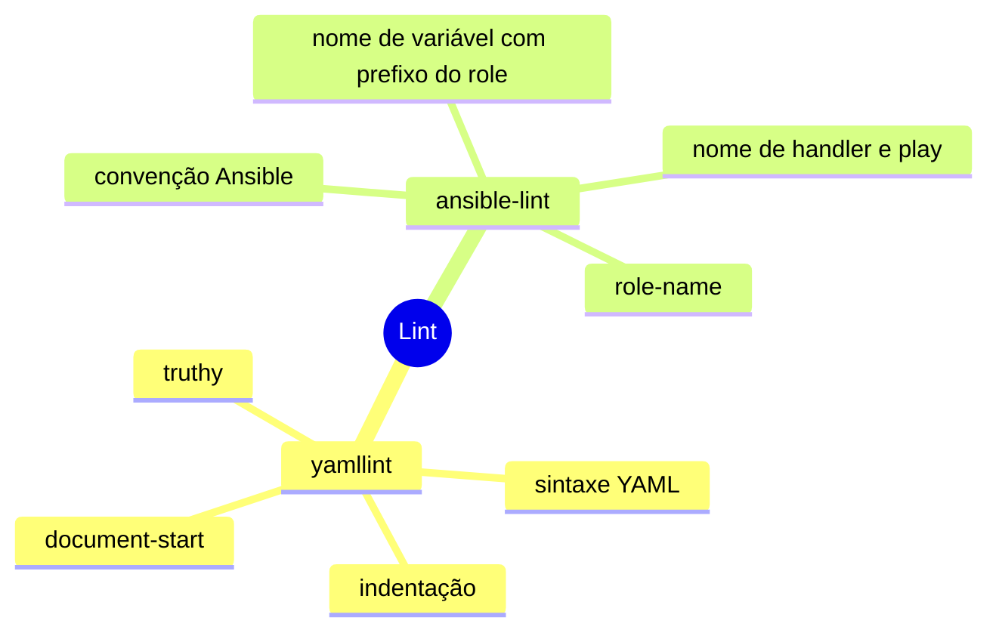

`.yamllint` e `.ansible-lint` na raiz. `ansible-lint` ignora `argocd/` (não é Ansible). Desde que o job `codigo-e-infra` de `quality.yml` existe, os dois rodam automaticamente em todo push e PR que toca `ansible/`, `argocd/`, `scripts/` ou os próprios workflows, não bloqueante ainda (ver [Qualidade de código e infraestrutura](#qualidade-de-codigo-e-infraestrutura)). Rodar local antes de propor mudança grande, com a mesma imagem usada em CI:

```bash
docker buildx bake --file tools/quality/docker-bake.hcl --load
docker run --rm -v "$PWD":/repo -w /repo infra-quality/python-lint:local uvx yamllint .
docker run --rm -v "$PWD":/repo -w /repo infra-quality/python-lint:local uvx --from ansible-lint ansible-lint
```

O repositório monta em `/repo`, não em `/workspace`: `/workspace` é onde a própria imagem guarda o `.config/hermit/` já instalado, montar o checkout ali por cima apagaria os binários que o hermit materializou durante o build.

## Qualidade da documentação

**TLDR**: dois gates bloqueantes só pra `docs/`/`README.md`, lychee (link quebrado) e um grep de travessão (estilo), os dois rodando desde bem antes deste registro existir.

O workflow `quality.yml` roda em todo push e PR que toca `docs/` ou o `README.md`, com dois gates: [lychee](https://lychee.cli.rs), um link checker assíncrono escrito em Rust, resolve cada link markdown, HTML e `mailto:` da página (link interno é resolvido contra o arquivo real no repositório, não só sintaxe), faz a requisição HTTP de verdade contra link externo, e cacheia o resultado entre execuções (`cache = true`, `max_cache_age = "1d"` em `.lychee.toml`) pra não martelar o mesmo host a cada push. Aceita `403`/`429` como resposta válida de bot-blocking, não link quebrado de verdade. Um segundo job falha se encontrar o caractere de travessão em qualquer arquivo `.md`, a regra de estilo deste repositório (ver [Referências](../aprender/referencias.md) e o restante da seção Aprender pra exemplo do tom esperado). O princípio por trás dos dois gates é o mesmo que a [documentação da Stripe](https://docs.stripe.com), citada como referência de qualidade em documentação de API, aplica: link quebrado ou inconsistência de estilo falha o build, não aparece publicado pra quem lê. Rodar localmente antes de propor mudança grande:

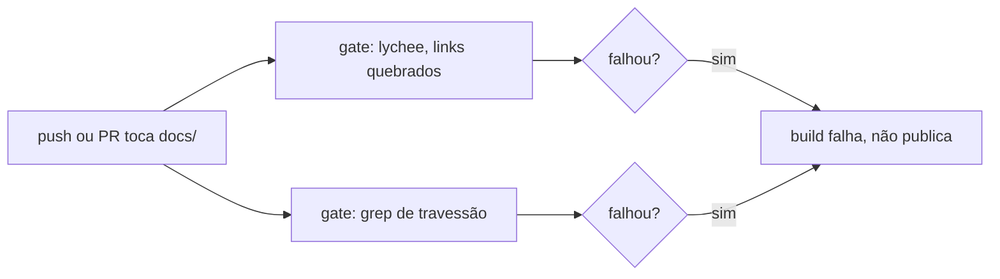

```bash
docker run --rm -v "$PWD":/docs -w /docs lycheeverse/lychee --config .lychee.toml 'docs/**/*.md' 'README.md'
```

## Qualidade de código e infraestrutura

**TLDR**: dez checks não bloqueantes (yamllint, ansible-lint, jscpd, kubeconform, shellcheck, actionlint, zizmor, cspell, ast-grep, kubescape), cada um rodando na sua própria imagem, todas nascidas de um stage `base` compartilhado via `docker buildx bake`, mais um step de fumaça bloqueante que garante que cada imagem de fato executa a ferramenta antes de qualquer check rodar (motivo na subseção "Por que oito checks falhavam sem ninguém notar" abaixo).

O job `codigo-e-infra` de `quality.yml` roda em todo push e PR que toca `docs/`, `ansible/`, `argocd/`, `scripts/`, `.ansible-lint`, `.yamllint`, `.cspell.config.yaml`, `tools/quality/` ou `.github/workflows/`. Todos os seus dez checks são não bloqueantes por enquanto (`continue-on-error: true`), até o time revisar o baseline de cada um e decidir quando promover a bloqueante:

- `yamllint` e `ansible-lint`: os dois lints já descritos em [Lint](#lint).
- `jscpd`: duplicação de bloco entre roles do Ansible e manifests do `argocd/`, mesmo padrão do task `infra-duplication` do portfólio (formato yaml, limiar de 65 tokens ou 5 linhas). Por baixo, tokeniza cada arquivo e usa Rabin-Karp (um algoritmo de hash de janela deslizante, o mesmo usado por ferramenta de detecção de plágio) pra achar trecho tokenizado igual em lugares diferentes, rápido o suficiente pra rodar em todo push mesmo num repositório grande. O manifesto vendorizado do cert-manager já passa hoje de 60% de duplicação sozinho, por isso este check começa não bloqueante.
- `kubeconform`: valida cada manifesto de `argocd/**/*.yaml` contra o schema OpenAPI oficial do Kubernetes (convertido pra JSON Schema, servido por um fork do `kubernetes-json-schema` mantido atualizado pra toda versão recente do Kubernetes). `-ignore-missing-schemas` pula recurso sem schema conhecido (CRD de terceiro, por exemplo) em vez de falhar. `-strict` rejeita propriedade extra não declarada no schema ou chave duplicada. Como não há Helm chart aqui (diferente do `bondspot-server`, que renderiza um chart antes de validar), roda direto contra o YAML cru.
- `shellcheck`: lint de `scripts/*.sh`. Cobre desde sintaxe incompatível com o shell declarado no shebang até bug real de quoting (variável sem aspas que quebra em espaço, glob que expande sem querer) e lógica inalcançável, cada categoria de aviso identificada por um código `SC` seguido de número (`SC2086`, por exemplo).
- `actionlint` e `zizmor`: lint e análise de segurança dos próprios arquivos em `.github/workflows/`. `actionlint` faz checagem de tipo de verdade nas expressões `${{ }}` (acessar propriedade que não existe, comparar tipo incompatível), confere que os `with:`/`outputs:` batem com o que a action de terceiro realmente declara, e roda `shellcheck`/`pyflakes` dentro de todo bloco `run:`. `zizmor` foca no lado de segurança: ação sem pin por hash (`unpinned-uses`, o achado que motivou a política de pin deste repositório), `checkout` sem `persist-credentials: false` que deixa credencial de push disponível pra um step seguinte não confiável (`artipacked`), e permissão declarada mais ampla que o job precisa (`excessive-permissions`).
- `cspell`: ortografia de `docs/`, `README.md` e dos nomes de step dos workflows. Entende identificador de código (separa `camelCase`/`snake_case` em palavras antes de checar cada uma), o que evita falso positivo em nome de variável mas também é o motivo de identificador sem acento em diagrama mermaid (`Seguranca`, `Operacao`) precisar entrar no dicionário próprio de `tools/quality/cspell-dictionary.txt`, junto com dicionário pt-BR e nome de ferramenta/sigla.
- `ast-grep`: enforça a regra de [Comentários em código](#comentarios-em-codigo), estruturalmente, não com grep de texto. Usa o parser de verdade de cada linguagem (tree-sitter) pra achar todo nó `comment` em `.yml`/`.yaml`, `.hcl` e `.sh`, com uma exceção por regex pra pragma funcional de ferramenta (`# noqa`, `# yamllint`, `# shellcheck disable`) e pro shebang, mais um `ignores` pro manifesto vendorizado do cert-manager na regra de yaml, mesmo tratamento que `jscpd`/`yamllint` já dão a ele. Config em `tools/quality/ast-grep/sgconfig.yml`, uma regra por linguagem em `tools/quality/ast-grep/rules/`.
- `kubescape`: postura de segurança dos manifestos em `argocd/`, sem precisar de cluster vivo (`kubescape scan argocd/`). Cobre um ângulo que o `trivy` de [Segurança](#seguranca) não cobre: mapeia achado contra framework de compliance nomeado (NSA-CISA Kubernetes Hardening Guide, MITRE ATT&CK for Containers, CIS Kubernetes Benchmark) e faz análise de RBAC de verdade (permissão sem escopo, HostPath mount gravável). `--exclude-namespaces cert-manager,cnpg-system` exclui os dois operadores vendorizados, mesmo motivo do `skip-dirs` do trivy (ver [Pendências](pendencias.md)). Da família de scanner de postura Kubernetes (kube-bench, kube-hunter, Polaris, KubeLinter, Checkov), só este entrou: os dois primeiros exigem cluster vivo, os três últimos encontram essencialmente o mesmo tipo de achado que o `trivy` já cobre.

Os dez não rodam numa imagem só: `tools/quality/Containerfile` é multi-stage, com um stage `base` (bootstrap mínimo de apt, mais `.config/hermit/` copiado) e um stage final por ferramenta (`actionlint`, `shellcheck`, `zizmor`, `python-lint`, `kubeconform`, `node-tools`, `ast-grep`, `kubescape`), cada um só com o `hermit install` da sua própria ferramenta. `tools/quality/docker-bake.hcl` declara um target por stage, e um `docker buildx bake` só builda as oito imagens em paralelo, reaproveitando a camada `base` entre todas (o bootstrap de apt não repete por ferramenta, só o download de cada binário). O job `codigo-e-infra` builda tudo de uma vez com `docker/bake-action` e depois roda cada check contra a imagem certa: `python-lint` pro `uvx`/`yamllint`/`ansible-lint`, `node-tools` pro `jscpd`/`cspell`, uma imagem dedicada pra `kubeconform`, `shellcheck`, `actionlint`, `zizmor`, `ast-grep` e `kubescape`.

Os sete stages finais compartilham o mesmo `base` (mesma relação de um `FROM base AS <stage>` no Dockerfile), o que um diagrama de classe representa melhor que um flowchart, porque a relação entre eles é literalmente herança de imagem, não sequência de passo:

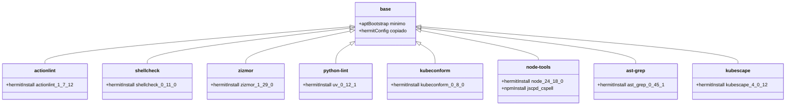

`actionlint`, `shellcheck`, `zizmor`, `uv`, `kubeconform`, `ast-grep` e `kubescape` vêm do [Hermit](https://cashapp.github.io/hermit/) em versão pinada (pacotes `.hcl` em `.config/hermit/hermit-packages/`, os três primeiros copiados do portfólio, `kubeconform.hcl`, `node.hcl`, `ast-grep.hcl` e `kubescape.hcl` escritos no mesmo formato). O release do `ast-grep` traz dois binários no mesmo zip, `sg` (um wrapper fino, hoje deprecado a favor do outro) e `ast-grep` (o binário real, ~53 MB, com o parser de toda linguagem suportada embutido): o `.hcl` declara só `ast-grep`, e é esse nome que os checks usam, não `sg`. `uv`/`uvx` por sua vez materializa `yamllint` e `ansible-lint` como ferramentas Python isoladas. `jscpd` e `cspell` são os dois únicos que só existem no registro do npm, sem binário solto pra virar pacote hermit: por isso o stage `node-tools` hermitiza só o `node`, e usa o `npm` dele pra instalar os dois. Cada `hermit install` roda dentro de `script -qefc "..." /dev/null`: sem isso, o prompt de confirmação de plataforma do próprio hermit trava o build com `sync /dev/stdout: invalid argument` num `RUN` sem TTY. Cada stage também roda como usuário `1000:1000` no runtime, não root. Todos os oito stages precisam de um `chmod -R a+rwX /opt/hermit-cache` logo depois do `hermit install`, porque o binário do próprio hermit saiu instalado sem permissão de execução pra quem não é root, e ao ser invocado como UID 1000 ele tenta se autorreparar (`chown`) e falha, já que `chown` exige privilégio que esse usuário não tem. Só `ast-grep` e `kubescape` tinham o `chmod` desde que entraram no pipeline. Os outros seis (`actionlint`, `shellcheck`, `zizmor`, `python-lint`, `kubeconform`, `node-tools`) ficaram sem ele até 2026-08-21, quando a investigação de um stage novo (`kube-diagrams`, ver [Topologia declarada do cluster](../arquitetura/topologia-declarada.md)) esbarrou no mesmo erro e motivou testar os outros de verdade, um por um, em vez de confiar num teste anterior que só validava o build, não a execução como o UID real de runtime. Todos os seis falhavam nesse mesmo erro em todo run de CI desde que cada check foi criado, mascarados pelo `continue-on-error: true`: o step nunca executava o lint de verdade, só o erro de bootstrap do hermit, sempre "passando" sem nunca ter rodado. A correção não muda o resultado esperado de nenhum check (eles continuam não bloqueantes), só faz eles rodarem pela primeira vez de fato, o que já revelou o primeiro baseline real de achado em `yamllint` (linha longa, indentação) a ser revisado como qualquer achado novo desta seção. Separado desse problema, o `base` também define `ENV HOME=/tmp`: sem `HOME` setado, o usuário `1000:1000` (sem entrada em `/etc/passwd`) cai num `$HOME` vazio, e ferramentas que usam `$HOME/.cache` pra guardar estado (o `uv`/`uvx` do `python-lint`, entre outras) tentam escrever em `/.cache`, que não pertence a esse usuário. `/tmp` já nasce com permissão `1777` (todo mundo escreve) em qualquer imagem baseada em Debian, por isso a escolha.

Existe um nono stage, `kube-diagrams` (herda de `python-lint`, acrescenta `graphviz`/`libgraphviz-dev`/`gcc` via apt e instala a ferramenta [KubeDiagrams](https://github.com/philippemerle/KubeDiagrams) com `uv tool install`), que fica fora do `group "default"` do bake e não roda em nenhum push: gera o diagrama de [Topologia declarada do cluster](../arquitetura/topologia-declarada.md), só invocado manualmente por quem editou `argocd/` e precisa atualizar o diagrama, nunca em CI (a ferramenta sorteia identificador novo a cada execução, então um check de "regenerou e comparou" desse diagrama específico ficaria permanentemente vermelho sem relação com mudança real, ver a página linkada pro raciocínio completo).

### Por que oito checks falhavam sem ninguém notar

Dos dez checks deste job, oito rodam dentro de um stage hermitizado (`actionlint`, `shellcheck`, `zizmor`, `python-lint` cobrindo `yamllint`/`ansible-lint`, `kubeconform`, `node-tools` cobrindo `jscpd`/`cspell`). Descontado `ast-grep` e `kubescape` (que já nasceram com o `chmod` certo), os outros seis vinham crashando desde que cada check foi criado: o processo nunca chegava a rodar o lint de verdade, morria antes, no erro de `chown` do próprio hermit tentando se autorreparar (ver parágrafo acima). Dois fatores em conjunto esconderam isso:

1. **`continue-on-error: true` não distingue "achou zero problema" de "nunca rodou"**: os dois casos produzem o mesmo resultado visível pra quem olha só o resumo do job no GitHub, um step cinza/check verde, sem nenhum sinal de que algo está errado.
2. **A validação de cada stage novo, até aqui, testava só `docker buildx bake` (o build da imagem), nunca `docker run <imagem> <ferramenta>` (a execução como o usuário `1000:1000` real de runtime)**: a etapa que falha (`chown`) só acontece em runtime, contra um UID sem privilégio, nunca durante o `RUN` do Containerfile (que roda como root até o `USER 1000:1000` no fim do stage). Um build bem-sucedido nunca foi garantia de que a ferramenta de fato executa depois.

A correção estrutural não é só o `chmod` (que resolve o sintoma nos oito stages), é fechar essa lacuna de validação: um step novo, **bloqueante** (sem `continue-on-error`), roda logo depois do bake e antes de qualquer check, chamando `--version`/equivalente em cada uma das dez ferramentas contra a imagem real. Se algum stage voltar a sair sem conseguir executar (esse bug reaparecendo, uma versão nova quebrando alguma dependência, qualquer causa), esse step falha de vez, sozinho, sem se misturar com o resultado do lint em si, que continua não bloqueante. Antes dessa mudança, não existia nenhum jeito de CI sinalizar "a ferramenta não roda" separado de "a ferramenta rodou e não achou nada", os dois pareciam a mesma coisa.

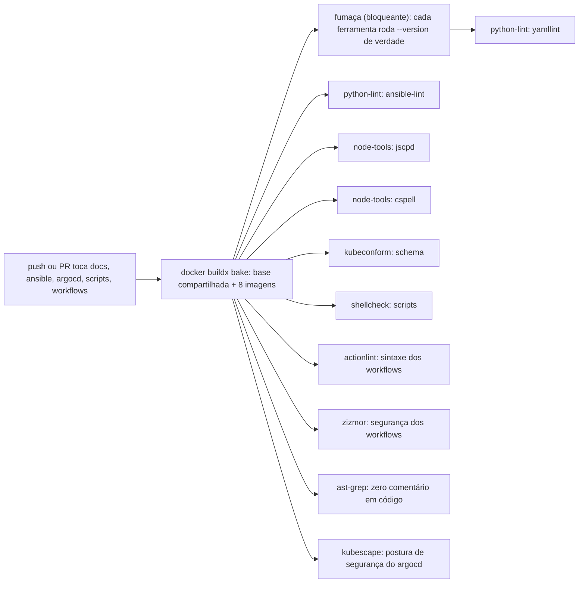

Toda ação de terceiro nos três workflows (`quality.yml`, `security.yml`, `docs.yml`) é referenciada por hash de commit, nunca por tag (`@v4`), e o hash escolhido é sempre de um release com pelo menos 7 dias publicado, não o mais recente disponível: um release comprometido costuma ser detectado e removido nesse intervalo, então esperar a janela reduz a chance de fixar exatamente a versão maliciosa. `zizmor` é quem verifica a primeira parte (hash, não tag). A janela de 7 dias é checada manualmente contra a data de publicação de cada release antes de trocar o pin.

Todo check novo deste job nasce não bloqueante e segue o mesmo ciclo de vida antes de virar gate de verdade:

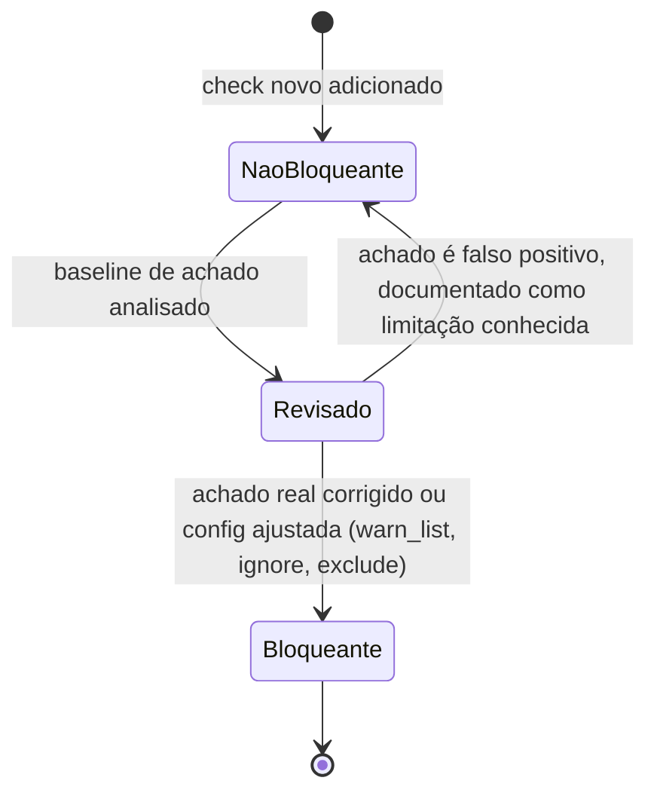

## Testar um role com Molecule

`yamllint` e `ansible-lint` (ver [Lint](#lint)) checam sintaxe e convenção, não se o role de fato converge um sistema real pro estado esperado. Pra isso existe [Molecule](../aprender/ansible.md#molecule): cria um alvo efêmero (normalmente um container Docker), roda o role de verdade contra ele, confere idempotência rodando de novo, e destrói o alvo no final. Nenhum scenario Molecule roda hoje em CI neste repositório, é uma ferramenta de uso local, sob demanda, não outro gate automático.

Nem todo role justifica o peso de manter um scenario: pra role simples, que só copia arquivo ou garante pacote instalado, `--check` (ver [Modo `--check`](../aprender/ansible.md#modo-check)) mais os lints já cobrem a maior parte do risco real. Vale escrever um scenario Molecule quando o role gerencia algo que só se comprova rodando de verdade (um serviço systemd, uma regra de rede) e o custo de um erro em produção é alto.

Mesmo assim, "vale a pena" não é garantia de que o teste vai ser confiável: um scenario Molecule foi tentado pro role [`firewalld`](../arquitetura/roles/firewalld.md), a mudança de maior risco deste bootstrap, e descartado depois de expor uma race real de D-Bus/polkit dentro do container aninhado (documentada pelo [próprio Ansible](https://github.com/ansible/ansible/issues/36483) e pelo [systemd](https://github.com/systemd/systemd/issues/13955), ver a seção completa em [Molecule](../aprender/ansible.md#molecule)) que tornava o tempo de execução do teste inconsistente. A correção da race em si (esperar o firewalld ficar de fato pronto antes do primeiro comando real) foi mantida no role, só o scenario de teste foi abandonado. Ver [Por que este role não tem um scenario Molecule](../arquitetura/roles/firewalld.md#por-que-este-role-nao-tem-um-scenario-molecule) pro raciocínio completo. Esse é o exemplo concreto do trade-off: nem toda mudança de alto risco se beneficia de automação de teste, às vezes a verificação manual supervisionada (já em uso pro `firewalld`, ver [passo 8 do bootstrap](bootstrap.md#8-ligar-o-firewalld)) é a opção mais confiável disponível.

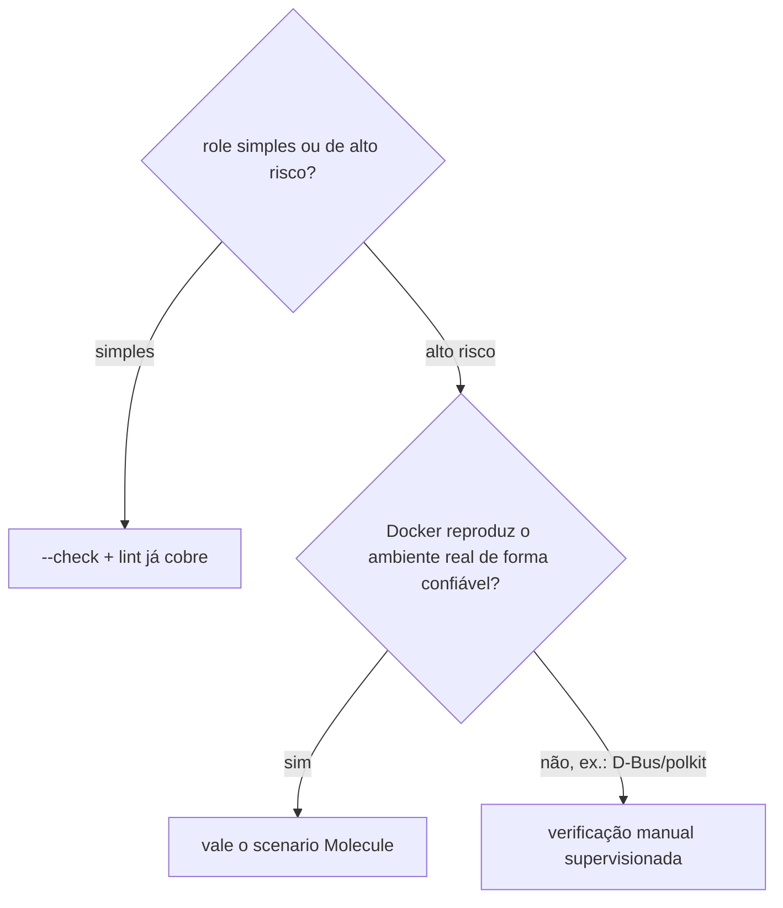

## Segurança

**TLDR**: `security.yml` roda gitleaks (segredo commitado, bloqueante) e trivy (misconfig de IaC, hoje consultivo) em três gatilhos diferentes (push, PR, e um cron semanal de rede de segurança).

```mermaid
timeline
    title Quando security.yml roda
    Push em main : roda gitleaks + trivy
    Todo PR : roda gitleaks + trivy
    Segunda 06:00 UTC : roda gitleaks + trivy, sem mudança de código
```

`security.yml` roda em todo push pra `main`, todo PR, e semanalmente às segundas-feiras às 06:00 UTC como rede de segurança, sem filtro de `paths`: segredo vazado ou misconfig importa mesmo sem mudança de código naquele push.

- [Gitleaks](https://github.com/gitleaks/gitleaks) varre o histórico inteiro de commit (equivalente a `git log -p`, não só o estado atual do checkout) atrás de credencial commitada, usando um conjunto de regras regex prontas pra formato conhecido de segredo (chave da AWS, chave privada PEM, padrão genérico de API key) mais detecção por entropia pra string que parece segredo mesmo sem bater um padrão nomeado. Bloqueante, mesmo padrão de segurança usado no `bondspot-server` desde o início do projeto (mesmo em fase MVP, quando outros checks foram desligados por velocidade de iteração). Roda direto via `docker run zricethezav/gitleaks`, não pelo `gitleaks/gitleaks-action` (o wrapper oficial da Action passou a exigir licença paga pra conta de organização a partir da v2, a CLI `gitleaks` em si continua livre).
- [Trivy](https://trivy.dev) roda com `scan-type: fs` e `scanners: misconfig`, avaliando Dockerfile, manifesto Kubernetes, Terraform e CloudFormation (os quatro formatos que o scanner de misconfig do Trivy entende) contra um conjunto de políticas prontas (porta exposta sem necessidade, container sem limite de recurso, permissão excessiva), severidade `HIGH` ou `CRITICAL` pra cima. Consultivo por enquanto (`continue-on-error: true`): os achados reais que já apareceram (`securityContext` ausente nas Deployments de `dados`/`rabbitmq`/`redis`, ver [débito técnico conhecido](../arquitetura/foundation.md#debito-tecnico-conhecido-securitycontext-ausente)) exigem uma varredura dedicada, UID por UID, pra não quebrar nenhum serviço de produção antes de virar bloqueante. `skip-dirs` exclui `argocd/apps/operators/cnpg`, manifesto vendorizado sem modificação: o RBAC amplo que o Trivy reclama nele é exigido pelo próprio operador pra funcionar, não é código deste repositório pra ajustar, o mesmo tratamento que `jscpd`/`yamllint` já dão a esse caminho. `cert-manager` tinha o mesmo tratamento até migrar pro chart oficial em 2026-08-21.

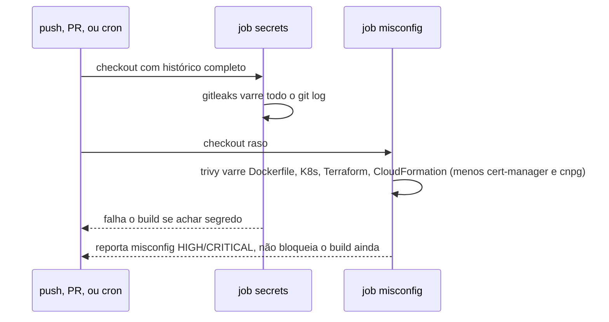

Ver [Vulnerability scanning](../aprender/vulnerability-scanning.md) pra entender secret scanning e SCA/misconfig como categoria, sem depender deste cluster específico.

## Bypass e afrouxamento de CI

**TLDR**: todo `continue-on-error`, `skip-dirs`, `--exclude-namespaces`, `warn_list`, ou qualquer outra forma de afrouxar um gate de CI entra em [Pendências](pendencias.md) junto com a justificativa, no mesmo commit que introduz o afrouxamento, não depois. A revisão de rotina do cluster (ver [Rotina de operação contínua](pendencias.md#rotina-de-operacao-continua-a-criar)) inclui reler essa lista pra achar o que já deveria ter voltado a ser bloqueante.

Regra simples, consequência de dois hábitos que já valiam mesmo antes de virar regra escrita: o próprio ciclo de vida documentado em [Qualidade de código e infraestrutura](#qualidade-de-codigo-e-infraestrutura) (todo check nasce não bloqueante, só é promovido depois de revisão) e as várias exclusões vendorizadas espalhadas por seis checks diferentes (ver [Pendências](pendencias.md)). O problema que a regra evita: um afrouxamento que faz sentido no dia em que foi introduzido, mas cuja justificativa nunca fica escrita em lugar nenhum, é indistinguível de esquecimento um ano depois, ninguém revisita algo que não sabe que existe.

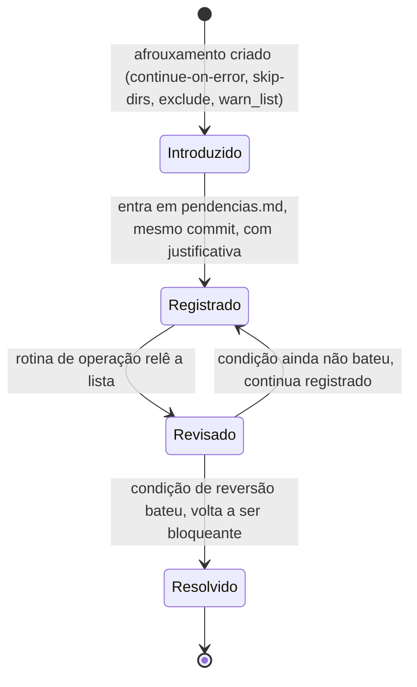

Isso não é regra nova de verdade, é a formalização por escrito de dois hábitos já em prática nesta seção inteira: [Segurança](#seguranca) já registrou o `continue-on-error` do trivy em `pendencias.md` no mesmo commit que o introduziu, e cada exclusão vendorizada (`skip-dirs`, `--exclude-namespaces`, `--ignore`, `ignorePaths`, `ignore` do yamllint) também já foi anotada lá com o motivo. A regra só torna explícito que isso vale sempre, não só quando alguém lembra.

## Licenças das ferramentas de CI

**TLDR**: toda ferramenta usada em CI tem a licença conferida antes de entrar, não depois. A maioria aqui é MIT ou Apache-2.0 (uso livre, sem obrigação de repassar código). Uma é GPLv3 (`shellcheck`), usada só como binário invocado via linha de comando, não linkada nem redistribuída, o que não aciona obrigação de copyleft. Um caso real já apareceu de um wrapper de ferramenta livre virar licença restrita numa major version (`gitleaks-action` v2), resolvido usando a CLI original direto.

| Ferramenta | Licença | Observação |
|---|---|---|
| Hermit | Apache-2.0 | |
| `actionlint` | MIT | |
| `shellcheck` | GPLv3 | Só invocado como CLI, sem linkar/redistribuir, sem obrigação de copyleft. |
| `zizmor` | MIT | |
| `uv` | MIT OR Apache-2.0 | Dupla licença, escolha de quem usa. |
| `kubeconform` | Apache-2.0 | |
| `node` | MIT | |
| `jscpd` | MIT | |
| `cspell` | MIT | |
| `ast-grep` | MIT | |
| `kubescape` | Apache-2.0 | Projeto incubating da CNCF. |
| `gitleaks` (CLI) | MIT | |
| `gitleaks-action` (Action, v2+) | Licença própria, não MIT | Por isso `security.yml` roda a imagem `zricethezav/gitleaks` direto via `docker run`, não a Action, ver [Segurança](#seguranca). |
| `trivy` | Apache-2.0 | Trocou de AGPL pra Apache-2.0 de propósito, pra reduzir barreira de integração. |
| `kubediagrams` | Apache-2.0 | Migrou de GPL-3.0 pra Apache-2.0 em 2025. Não é gate de CI, só geração manual de diagrama, ver [Topologia declarada do cluster](../arquitetura/topologia-declarada.md). |

O caso do `gitleaks-action` é o exemplo concreto do porquê essa checagem não é formalidade: a ferramenta em si (`gitleaks`, a CLI) continua MIT, livre, sem custo, mas o wrapper oficial que a maioria dos tutoriais indica (`gitleaks/gitleaks-action`) mudou de licença numa major version, e passou a exigir licença paga pra conta de organização. Rodar a imagem Docker da CLI direto, sem o wrapper, contorna isso sem perder a checagem real. Conferir isso de novo faz parte da rotina de revisão de versão (ver [Bypass e afrouxamento de CI](#bypass-e-afrouxamento-de-ci) acima e [Pendências](pendencias.md)): licença pode mudar numa atualização de versão, não só na adoção inicial.

## Donos de código e atualização de dependências

**TLDR**: `CODEOWNERS` marca `@ladesa-ro/security`/`@ladesa-ro/devops` em todo caminho sensível a CI e infraestrutura, `dependabot.yml` atualiza os três tipos de dependência reais deste repositório, sempre com 7 dias de espera antes de propor a versão nova.

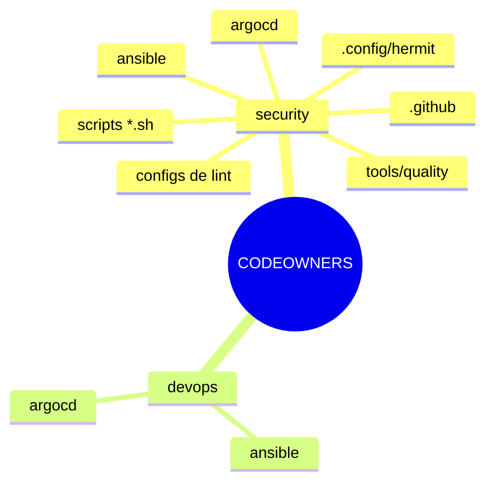

`CODEOWNERS` na raiz segue o mesmo padrão do `management-service`: `@ladesa-ro/security` em todo caminho sensível a CI e segurança (`.github/`, `ansible/`, `argocd/`, `tools/quality/`, `.config/hermit/`, os scripts `.sh`, os arquivos de config dos linters), `@ladesa-ro/devops` também nos caminhos de infraestrutura de fato (`ansible/`, `argocd/`).

`.github/dependabot.yml` cobre as três coisas que este repositório de fato declara como dependência: as próprias actions dos workflows (`github-actions`), a imagem base do `tools/quality/Containerfile` (`docker`), e os pacotes Python do `requirements-docs.txt` que buildam a doc (`pip`). Todos os três usam `cooldown: default-days: 7`, a mesma janela de 7 dias usada pro pin manual de hash das actions (ver [Qualidade de código e infraestrutura](#qualidade-de-codigo-e-infraestrutura)): o Dependabot não abre PR pra uma versão nova até ela ter pelo menos 7 dias publicada, pelo mesmo motivo, dar tempo de um release comprometido ser detectado antes de chegar aqui.

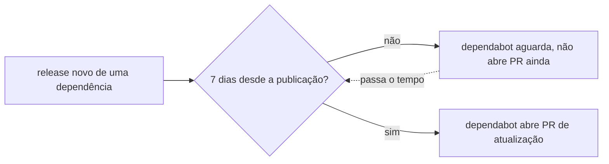

## Commits

**TLDR**: [Conventional Commits](../aprender/git.md#conventional-commits) só no título, sem corpo, sem `Co-Authored-By`, enforçado por `commit-lint.yml` a cada push em `main`, hoje não bloqueante.

Os commits aqui seguem Conventional Commits só no título, `type(scope): subject`. Sem corpo, sem Co-Authored-By.

`commit-lint.yml` roda `scripts/lint-commit-messages.sh` contra o intervalo de commit novo de cada push (`github.event.before..github.sha`, ou só o commit único quando `before` é a SHA zerada de um branch novo), checando as três regras acima em cada um: título bate o regex `^(feat|fix|docs|style|refactor|perf|test|build|ci|chore)(\(escopo\))?: assunto`, mensagem sem linha de corpo, sem `Co-Authored-By` em nenhum lugar da mensagem completa.

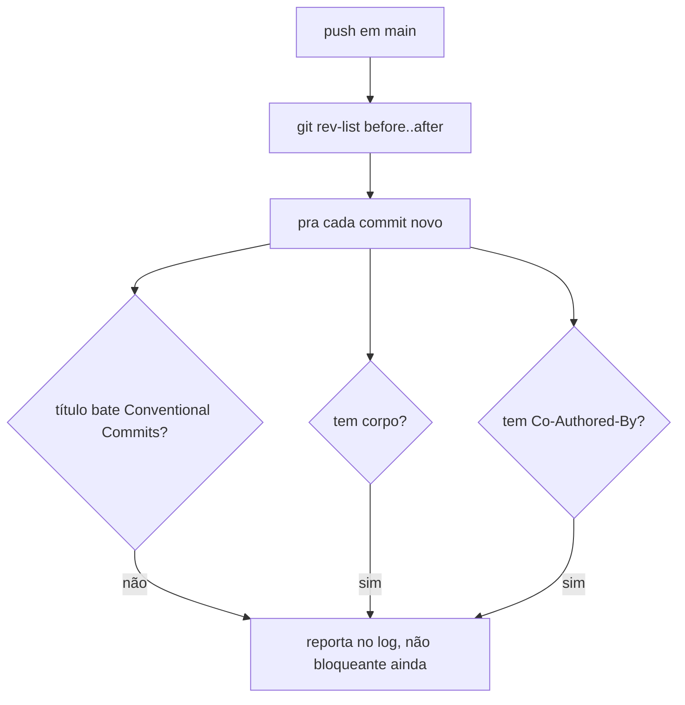
