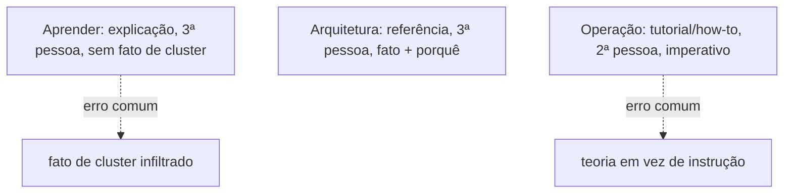
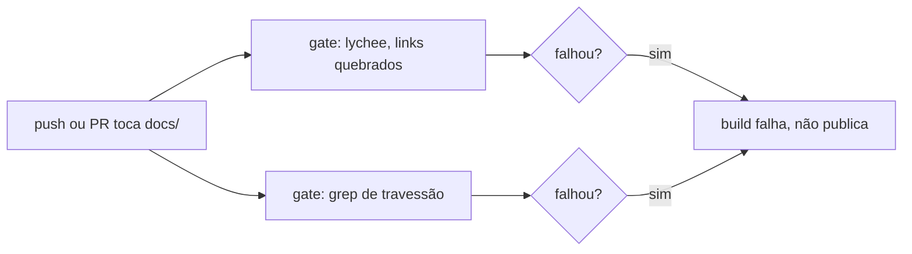
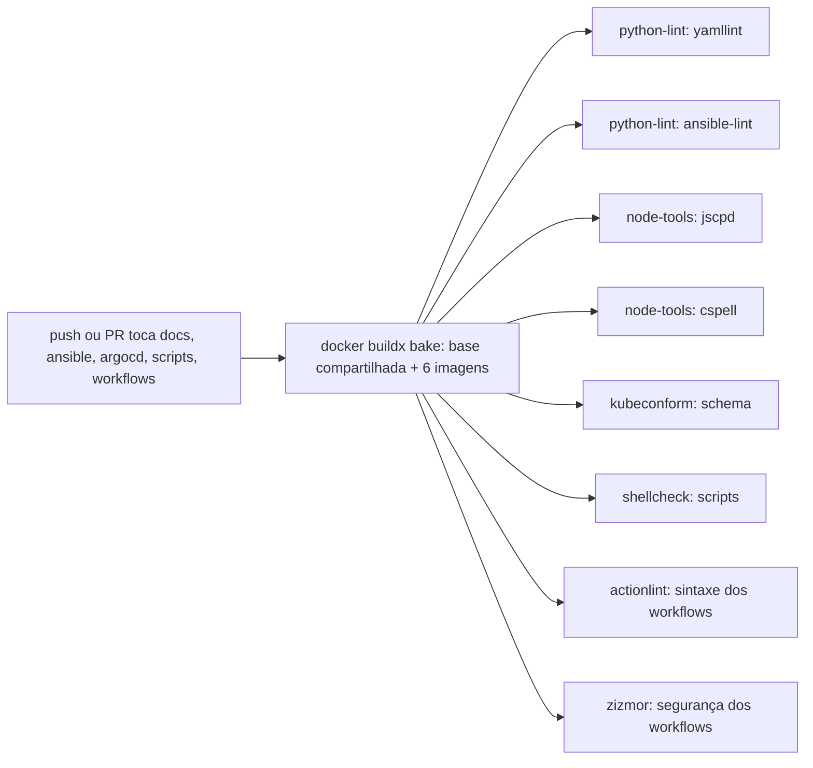
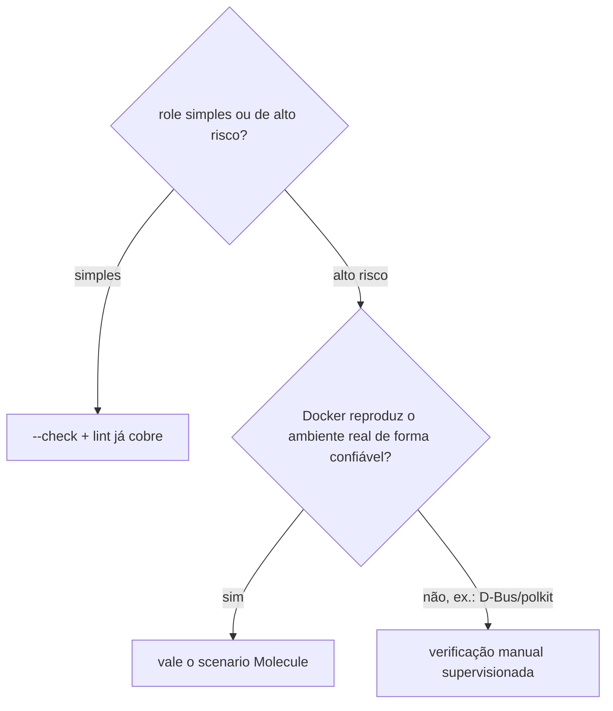

# Desenvolvimento

**TLDR**: três modos, três vozes (Aprender impessoal, Arquitetura fatual, Operação imperativa); linha editorial adaptada de oito style guides externos; dois gates de CI da documentação (lychee + travessão), oito checks de código e infraestrutura não bloqueantes rodando numa imagem thin com hermit, e dois gates de segurança bloqueantes (gitleaks + trivy); commits Conventional Commits só no título.

| Termo | Vá pra |
|---|---|
| Modo e voz por seção | [Estrutura de conteúdo](#estrutura-de-conteudo-modo-e-voz-por-secao) |
| Regras de redação adotadas | [Linha editorial](#linha-editorial) |
| Lint de Ansible/YAML | [Lint](#lint) |
| Gates de CI da documentação | [Qualidade da documentação](#qualidade-da-documentacao) |
| Duplicação, schema, shellcheck e lint dos próprios workflows | [Qualidade de código e infraestrutura](#qualidade-de-codigo-e-infraestrutura) |
| Quando vale testar um role contra um sistema real, não só lint | [Testar um role com Molecule](#testar-um-role-com-molecule) |
| Secret scanning e misconfig de IaC | [Segurança](#seguranca) |
| CODEOWNERS e cooldown do Dependabot | [Donos de código e atualização de dependências](#donos-de-codigo-e-atualizacao-de-dependencias) |
| Convenção de commit | [Commits](#commits) |

## Estrutura de conteúdo: modo e voz por seção

As três trilhas ([Aprender](../aprender/index.md), [Arquitetura](../arquitetura/index.md), [Operação](checklist.md)) seguem [Diátaxis](../aprender/diataxis.md), não são só uma divisão temática. Cada seção corresponde a um modo diferente, e o modo determina tanto o que entra em cada página quanto a voz usada pra escrever ela:

**Aprender é explicação**: terceira pessoa, impessoal ("um Operator é", não "você vai usar um Operator"), sem instrução nenhuma ("faça X"), sem fato específico de um cluster real (ver a regra completa em [Referências](../aprender/referencias.md) e no restante da seção). O teste rápido: se a frase começa a soar como comando ou como "isto aqui, especificamente, faz assim", ela não pertence ao Aprender.

**Arquitetura é referência**: fato sobre este cluster específico, organizado pra consulta rápida, com o porquê de cada decisão registrado ao lado do fato (não uma explicação de conceito geral, isso já está no Aprender, só o raciocínio da escolha feita aqui). Terceira pessoa também, mas fatual, não instrucional.

**Operação é tutorial e how-to guide**: segunda pessoa, voz ativa, modo imperativo ("copie a chave", "rode o comando"), assumindo que quem lê já sabe o básico (isso está no Aprender) e só precisa do passo concreto. `bootstrap.md`, guiado do início ao fim pra quem nunca fez, é mais tutorial; `checklist.md`, pra quem já sabe e só quer confirmar onde parou, é mais how-to guide.

Misturar um modo com outro é o erro mais comum que Diátaxis nomeia: uma página do Aprender que menciona um fato real deste cluster, ou uma página de Operação que para pra explicar teoria em vez de instruir, confunde as duas pessoas que estavam lendo por motivos diferentes.



## Linha editorial

Além da estrutura por modo acima, as regras de redação abaixo vêm de ler os style guides de documentação técnica mais citados do mercado: [Google](https://developers.google.com/style/), [Microsoft](https://learn.microsoft.com/en-us/style-guide/welcome/), [GitHub](https://docs.github.com/en/contributing/style-guide-and-content-model/style-guide), [GitLab](https://docs.gitlab.com/development/documentation/styleguide/), [Red Hat](https://redhat-documentation.github.io/supplementary-style-guide/), [MDN](https://developer.mozilla.org/en-US/docs/MDN/Writing_guidelines) e [Docker](https://github.com/docker/docs/blob/main/CONTRIBUTING.md), além da [documentação da Stripe](https://docs.stripe.com) como referência de organização e experiência de leitura, não de regra de redação. Nem toda regra desses guias se aplica aqui, cada um foi escrito pro contexto de quem o mantém; o que segue é o subconjunto que fez sentido adotar.

**Adotado:**

- Título em sentence case, nunca Title Case (convenção comum a Google, GitHub, GitLab e Docker), já natural em português, onde Title Case nem é gramatical.
- Sem travessão em texto corrido, regra já em vigor aqui e reforçada pelo próprio guia do GitLab, que proíbe o mesmo caractere pelo mesmo motivo, poluição visual sem ganho de clareza.
- Texto de link sempre descritivo (`ver [Argo CD](argocd.md)`), nunca genérico (`clique aqui`), regra idêntica em Google e GitLab.
- Sem linguagem de marketing nem superlativo não verificável ("a melhor ferramenta", "simplesmente resolve tudo"): toda comparação entre ferramentas nesta doc vem acompanhada do trade-off real, não só da vantagem.
- Sem autorreferência de preenchimento ("esta página explica", "neste guia vamos ver"), regra explícita do GitLab. A frase de modo Diátaxis que abre cada seção (ver acima) é a exceção deliberada: não é preenchimento, é sinalização estrutural do que o leitor está prestes a ler.
- Título de procedimento no imperativo, não no gerúndio ("Instalar as dependências", não "Instalando as dependências"), regra do Red Hat, já seguida em `bootstrap.md`.
- Um comando por bloco de código quando o passo precisa ser copiado isoladamente, regra do Red Hat, já seguida em `bootstrap.md`.
- Valor que quem lê precisa substituir sempre em `<algo>`, nunca em texto solto sem marcação.

**Considerado e descartado:**

- Proibição de ponto e vírgula, regra explícita do GitLab. Não adotada aqui: conflita com o estilo de prosa densa já estabelecido nesta doc, em português o ponto e vírgula une duas orações relacionadas sem quebrar o parágrafo em frases curtas demais, o oposto do que a maioria desses guias otimiza (escritos em inglês, pra um estilo mais fatiado em lista).
- Uso de contração como sinal de tom amigável, regra de Microsoft e GitLab. Não se aplica: contração é um mecanismo do inglês (`don't`, `it's`) sem equivalente direto em português.

## Lint

`.yamllint` e `.ansible-lint` na raiz. `ansible-lint` ignora `argocd/` (não é Ansible). Desde que o job `codigo-e-infra` de `quality.yml` existe, os dois rodam automaticamente em todo push e PR que toca `ansible/`, `argocd/`, `scripts/` ou os próprios workflows, não bloqueante ainda (ver [Qualidade de código e infraestrutura](#qualidade-de-codigo-e-infraestrutura)). Rodar local antes de propor mudança grande, com a mesma imagem usada em CI:

```bash
docker buildx bake --file tools/quality/docker-bake.hcl --load
docker run --rm -v "$PWD":/repo -w /repo infra-quality/python-lint:local uvx yamllint .
docker run --rm -v "$PWD":/repo -w /repo infra-quality/python-lint:local uvx --from ansible-lint ansible-lint
```

O repositório monta em `/repo`, não em `/workspace`: `/workspace` é onde a própria imagem guarda o `.config/hermit/` já instalado, montar o checkout ali por cima apagaria os binários que o hermit materializou durante o build.

## Qualidade da documentação

O workflow `quality.yml` roda em todo push e PR que toca `docs/` ou o `README.md`, com dois gates: [lychee](https://lychee.cli.rs) checa todo link externo e interno das páginas (configurado em `.lychee.toml`, aceitando `403`/`429` como respostas válidas de bot-blocking, não link quebrado de verdade), e um segundo job falha se encontrar o caractere de travessão em qualquer arquivo `.md`, a regra de estilo deste repositório (ver [Referências](../aprender/referencias.md) e o restante da seção Aprender pra exemplo do tom esperado). O princípio por trás dos dois gates é o mesmo que a [documentação da Stripe](https://docs.stripe.com), citada como referência de qualidade em documentação de API, aplica: link quebrado ou inconsistência de estilo falha o build, não aparece publicado pra quem lê. Rodar localmente antes de propor mudança grande:



```bash
docker run --rm -v "$PWD":/docs -w /docs lycheeverse/lychee --config .lychee.toml 'docs/**/*.md' 'README.md'
```

## Qualidade de código e infraestrutura

O job `codigo-e-infra` de `quality.yml` roda em todo push e PR que toca `docs/`, `ansible/`, `argocd/`, `scripts/`, `.ansible-lint`, `.yamllint`, `.cspell.config.yaml`, `tools/quality/` ou `.github/workflows/`. Todos os seus oito checks são não bloqueantes por enquanto (`continue-on-error: true`), até o time revisar o baseline de cada um e decidir quando promover a bloqueante:

- `yamllint` e `ansible-lint`: os dois lints já descritos em [Lint](#lint).
- `jscpd`: duplicação de bloco entre roles do Ansible e manifests do `argocd/`, mesmo padrão do task `infra-duplication` do portfólio (formato yaml, limiar de 65 tokens ou 5 linhas). O manifesto vendorizado do cert-manager já passa hoje de 60% de duplicação sozinho, por isso este check começa não bloqueante.
- `kubeconform`: valida cada manifesto de `argocd/**/*.yaml` contra o schema oficial do Kubernetes. Como não há Helm chart aqui (diferente do `bondspot-server`, que renderiza um chart antes de validar), roda direto contra o YAML cru.
- `shellcheck`: lint de `scripts/*.sh`.
- `actionlint` e `zizmor`: lint e análise de segurança dos próprios arquivos em `.github/workflows/`, achando problema de sintaxe, permissão excessiva no nível errado do workflow, ou ação de terceiro referenciada por tag em vez de hash de commit.
- `cspell`: ortografia de `docs/`, `README.md` e dos nomes de step dos workflows, com dicionário pt-BR mais uma lista própria em `tools/quality/cspell-dictionary.txt` pros nomes de ferramenta, siglas, e os identificadores sem acento que os diagramas mermaid usam (`Seguranca`, `Operacao`, etc.).

Os oito não rodam numa imagem só: `tools/quality/Containerfile` é multi-stage, com um stage `base` (bootstrap mínimo de apt, mais `.config/hermit/` copiado) e um stage final por ferramenta (`actionlint`, `shellcheck`, `zizmor`, `python-lint`, `kubeconform`, `node-tools`), cada um só com o `hermit install` da sua própria ferramenta. `tools/quality/docker-bake.hcl` declara um target por stage, e um `docker buildx bake` só builda as seis imagens em paralelo, reaproveitando a camada `base` entre todas (o bootstrap de apt não repete por ferramenta, só o download de cada binário). O job `codigo-e-infra` builda tudo de uma vez com `docker/bake-action` e depois roda cada check contra a imagem certa: `python-lint` pro `uvx`/`yamllint`/`ansible-lint`, `node-tools` pro `jscpd`/`cspell`, uma imagem dedicada pra `kubeconform`, `shellcheck`, `actionlint` e `zizmor`.

`actionlint`, `shellcheck`, `zizmor`, `uv` e `kubeconform` vêm do [Hermit](https://cashapp.github.io/hermit/) em versão pinada (pacotes `.hcl` em `.config/hermit/hermit-packages/`, os três primeiros copiados do portfólio, `kubeconform.hcl` e `node.hcl` escritos no mesmo formato). `uv`/`uvx` por sua vez materializa `yamllint` e `ansible-lint` como ferramentas Python isoladas. `jscpd` e `cspell` são os dois únicos que só existem no registro do npm, sem binário solto pra virar pacote hermit: por isso o stage `node-tools` hermitiza só o `node`, e usa o `npm` dele pra instalar os dois. Cada `hermit install` roda dentro de `script -qefc "..." /dev/null`: sem isso, o prompt de confirmação de plataforma do próprio hermit trava o build com `sync /dev/stdout: invalid argument` num `RUN` sem TTY.



Toda ação de terceiro nos três workflows (`quality.yml`, `security.yml`, `docs.yml`) é referenciada por hash de commit, nunca por tag (`@v4`), e o hash escolhido é sempre de um release com pelo menos 7 dias publicado, não o mais recente disponível: um release comprometido costuma ser detectado e removido nesse intervalo, então esperar a janela reduz a chance de fixar exatamente a versão maliciosa. `zizmor` é quem verifica a primeira parte (hash, não tag); a janela de 7 dias é checada manualmente contra a data de publicação de cada release antes de trocar o pin.

## Testar um role com Molecule

`yamllint` e `ansible-lint` (ver [Lint](#lint)) checam sintaxe e convenção, não se o role de fato converge um sistema real pro estado esperado. Pra isso existe [Molecule](../aprender/ansible.md#molecule): cria um alvo efêmero (normalmente um container Docker), roda o role de verdade contra ele, confere idempotência rodando de novo, e destrói o alvo no final. Nenhum scenario Molecule roda hoje em CI neste repositório, é uma ferramenta de uso local, sob demanda, não outro gate automático.

Nem todo role justifica o peso de manter um scenario: pra role simples, que só copia arquivo ou garante pacote instalado, `--check` (ver [Modo `--check`](../aprender/ansible.md#modo-check)) mais os lints já cobrem a maior parte do risco real. Vale escrever um scenario Molecule quando o role gerencia algo que só se comprova rodando de verdade (um serviço systemd, uma regra de rede) e o custo de um erro em produção é alto.

Mesmo assim, "vale a pena" não é garantia de que o teste vai ser confiável: um scenario Molecule foi tentado pro role [`firewalld`](../arquitetura/roles/firewalld.md), a mudança de maior risco deste bootstrap, e descartado depois de expor uma race real de D-Bus/polkit dentro do container aninhado (documentada pelo [próprio Ansible](https://github.com/ansible/ansible/issues/36483) e pelo [systemd](https://github.com/systemd/systemd/issues/13955), ver a seção completa em [Molecule](../aprender/ansible.md#molecule)) que tornava o tempo de execução do teste inconsistente. A correção da race em si (esperar o firewalld ficar de fato pronto antes do primeiro comando real) foi mantida no role, só o scenario de teste foi abandonado; ver [Por que este role não tem um scenario Molecule](../arquitetura/roles/firewalld.md#por-que-este-role-nao-tem-um-scenario-molecule) pro raciocínio completo. Esse é o exemplo concreto do trade-off: nem toda mudança de alto risco se beneficia de automação de teste, às vezes a verificação manual supervisionada (já em uso pro `firewalld`, ver [passo 8 do bootstrap](bootstrap.md#8-ligar-o-firewalld)) é a opção mais confiável disponível.



## Segurança

`security.yml` roda em todo push pra `main`, todo PR, e semanalmente às segundas-feiras às 06:00 UTC como rede de segurança, sem filtro de `paths`: segredo vazado ou misconfig importa mesmo sem mudança de código naquele push. Os dois gates são bloqueantes, mesmo padrão de segurança usado no `bondspot-server` desde o início do projeto (mesmo em fase MVP, quando outros checks foram desligados por velocidade de iteração):

- [Gitleaks](https://github.com/gitleaks/gitleaks) varre o histórico inteiro de commit atrás de credencial commitada.
- [Trivy](https://trivy.dev) roda com `scan-type: fs` e `scanners: misconfig`, achando má configuração em manifesto Kubernetes e Ansible (porta exposta sem necessidade, container sem limite de recurso, permissão excessiva), severidade `HIGH` ou `CRITICAL` pra cima.

Ver [Vulnerability scanning](../aprender/vulnerability-scanning.md) pra entender secret scanning e SCA/misconfig como categoria, sem depender deste cluster específico.

## Donos de código e atualização de dependências

`CODEOWNERS` na raiz segue o mesmo padrão do `management-service`: `@ladesa-ro/security` em todo caminho sensível a CI e segurança (`.github/`, `ansible/`, `argocd/`, `tools/quality/`, `.config/hermit/`, os scripts `.sh`, os arquivos de config dos linters), `@ladesa-ro/devops` também nos caminhos de infraestrutura de fato (`ansible/`, `argocd/`).

`.github/dependabot.yml` cobre as três coisas que este repositório de fato declara como dependência: as próprias actions dos workflows (`github-actions`), a imagem base do `tools/quality/Containerfile` (`docker`), e os pacotes Python do `requirements-docs.txt` que buildam a doc (`pip`). Todos os três usam `cooldown: default-days: 7`, a mesma janela de 7 dias usada pro pin manual de hash das actions (ver [Qualidade de código e infraestrutura](#qualidade-de-codigo-e-infraestrutura)): o Dependabot não abre PR pra uma versão nova até ela ter pelo menos 7 dias publicada, pelo mesmo motivo, dar tempo de um release comprometido ser detectado antes de chegar aqui.

## Commits

Os commits aqui seguem [Conventional Commits](../aprender/git.md#conventional-commits) só no título, `type(scope): subject`. Sem corpo, sem Co-Authored-By.
