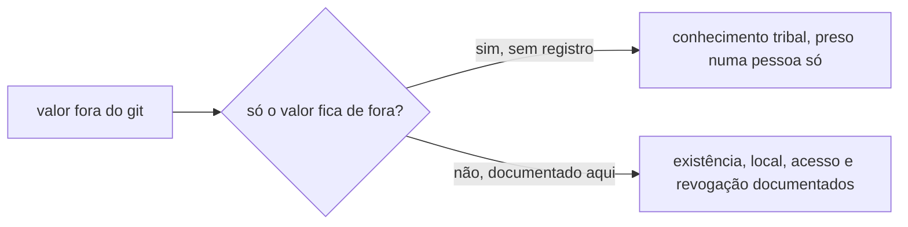
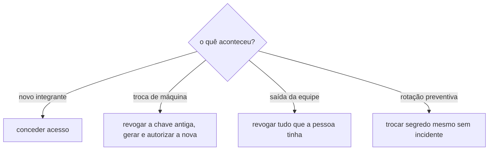

# Estado fora do git

Este repositório não guarda tudo. Não pode: senha e chave privada, por definição, não vão pra um repositório em texto puro nem cifrado sem necessidade. O risco disso não é o valor estar fora do git, é o quê está fora do git virar conhecimento tribal que ninguém mais lembra, preso na cabeça ou no laptop de uma pessoa só. Esta página existe pra isso não acontecer: cada item aponta pra uma coisa que não está versionada, onde ela vive, quem deveria conseguir acessá-la, e como recriar ou revogar se necessário.



Esta página cobre dois tipos bem diferentes de segredo fora do git, e a distinção importa pra saber o que fazer quando alguém troca de máquina, entra ou sai da equipe:

- **Segredo de sistema**: vive num arquivo, num node, num cofre. Uma pessoa recria ou revoga executando um comando.
- **Acesso pessoal**: vive na cabeça e no laptop de alguém, uma chave SSH, uma sessão logada num painel. Uma pessoa só consegue revogar o acesso de outra pessoa, a própria pessoa não "recria" isso sozinha.

## A. Segredos de sistema (node, cofres, CI)

| O quê | Onde | Arquivo ou local exato | Por que não pode estar no git | Como recriar se perder |
|---|---|---|---|---|
| Senha do [Ansible Vault](../aprender/ansible.md#ansible-vault) | *node* | `/root/infrastructure-vault-pass`, `0600` | decripta os cinco arquivos cifrados em `infrastructure-vault` | Gerar senha nova (`openssl rand -base64 32 > ...`), depois rodar `scripts/create-from-cluster` de novo pros quatro Secrets (eles ainda existem no cluster) e recapturar `k3s-token` a partir de `/var/lib/rancher/k3s/server/token`, sobrescrevendo os arquivos cifrados em `infrastructure-vault` |
| [Deploy key](../aprender/ssh.md#chave-pessoal-vs-deploy-key) SSH do `infrastructure`, metade privada | *node* | `/root/.ssh/infrastructure-deploy-key` | dá acesso de clone (read-only) ao repositório `infrastructure` | Gerar par novo (isso também invalida a metade pública já registrada, ver linha abaixo) |
| Deploy key SSH do `infrastructure`, metade pública | *GitHub* | Settings > Deploy keys, do repositório `infrastructure`. Hoje só existe uma, título `ldsa (node)`, `read_only: true`; conferir com `gh api repos/ladesa-ro/infrastructure/keys` | é o que autoriza a chave privada acima | Registrar a nova chave pública gerada ao lado, remover a antiga |
| Deploy key SSH do `infrastructure-vault`, metade privada | *node* | `/root/.ssh/infrastructure-vault-deploy-key` | dá acesso de clone (read-only) ao repositório `infrastructure-vault` | Gerar par novo (isso também invalida a metade pública já registrada, ver linha abaixo) |
| Deploy key SSH do `infrastructure-vault`, metade pública | *GitHub* | Settings > Deploy keys, do repositório `infrastructure-vault`. Hoje só existe uma, título `ldsa (node)`, `read_only: true`; conferir com `gh api repos/ladesa-ro/infrastructure-vault/keys` | é o que autoriza a chave privada acima | Registrar a nova chave pública gerada ao lado, remover a antiga |
| `ansible-core`, `jq` e o CLI do `argocd` | *node* | pacotes `apt` e binário em `/usr/local/bin` | continuam nesta tabela só pelo primeiro provisionamento: num node vazio eles precisam existir antes de qualquer Ansible rodar, e por isso o `bootstrap.yml` os instala via `raw`. Depois disso deixam de ser estado fora do git, os pacotes são declarados por [`pacotes-base`](../arquitetura/roles/pacotes-base.md) e o binário do `argocd` é fixado por versão e checksum no próprio `bootstrap.yml` | Ver [passo 1 do bootstrap](bootstrap.md#1-instalar-as-dependencias-no-node) |
| Projetos e valores no [Infisical](../aprender/infisical.md) | *Infisical* | `infisical.ladesa.com.br`: `foundation-mariadb-6s-ji`, `foundation-minio-z-hvh` | senha de app/banco tem sistema próprio pra isso, o Infisical, não faz sentido duplicar em outro cofre | Recriar o projeto, colar o valor, conceder acesso de leitura à machine identity `universal-auth-credentials`, atualizar o `projectSlug` no `infisicalsecret-*.yaml` correspondente |
| Acesso da machine identity aos projetos do Infisical | *Infisical* | dentro de cada projeto, Access Control | é permissão, não segredo, mas só existe na configuração do Infisical, não em arquivo nenhum | Conceder de novo, projeto por projeto, pela UI |
| `GITHUB_TOKEN` usado em `security.yml` | *GitHub Actions* | gerado automaticamente pelo próprio GitHub a cada execução | é efêmero por natureza, GitHub Actions cuida disso sozinho | Nada a fazer, não é um segredo configurado manualmente |

## B. Acesso pessoal (chave e conta na máquina de cada pessoa)

Diferente da seção A, nenhum destes itens tem um comando que "recria". Uma pessoa só entra ou sai dessas listas pela ação de outra pessoa que já tem acesso administrativo.

| O quê | Onde vive | O que autoriza | Quem consegue revogar |
|---|---|---|---|
| Chave SSH pessoal pro GitHub (`~/.ssh/id_*`, associada à conta pessoal) | laptop de cada pessoa | leitura e escrita em todo repositório que a conta tem acesso, não só `infrastructure`; ver [chave pessoal vs. deploy key](../aprender/ssh.md#chave-pessoal-vs-deploy-key) | a própria pessoa (removendo a chave pública em GitHub > Settings > SSH keys) ou um owner da organização removendo a conta da org |
| Membresia na organização `ladesa-ro` no GitHub | conta pessoal de GitHub de cada pessoa | acesso aos repositórios privados da organização, incluindo `infrastructure-vault` | um *owner* da organização, em `github.com/orgs/ladesa-ro/people`; conferir a lista atual com `gh api orgs/ladesa-ro/members --jq '.[].login'` (exige estar autenticado com uma conta que já é membro) |
| Papel de *owner* na organização `ladesa-ro` | atributo da conta pessoal dentro da org | quem tem esse papel pode registrar/remover deploy keys, mudar quem é membro, apagar repositório, mudar branch protection; é o nível de acesso mais crítico de toda esta lista | outro *owner* já existente; se **nenhum** owner sobrar (ex.: a única pessoa saiu sem transferir o papel), só o suporte do GitHub resolve, processo lento, então nunca deixar a org com um único owner |
| Acesso SSH ao node `ldsa` | `~/.ssh/config` de cada máquina que precisa administrar o node direto (alias, endereço, porta) | conexão root completa ao servidor de produção | quem administra o node, removendo a chave pública correspondente de `/root/.ssh/authorized_keys` no próprio node |
| Membresia na malha [ZeroTier](../aprender/ssh.md#vpn-ponto-a-site-vs-malha) usada como rede administrativa | conta em `my.zerotier.com` (ou self-hosted equivalente) que administra a network do cluster | é o único jeito de alcançar a API do k3s e a interface de administração depois que o [firewalld](../arquitetura/roles/firewalld.md) está ativo, já que a zona pública só libera 22/80/443; ver `firewalld_interface_admin` em [firewalld](../arquitetura/roles/firewalld.md) | quem administra a conta ZeroTier, autorizando/desautorizando o dispositivo na network |
| Conta no provedor que hospeda a VM do node (painel de VPS/cloud) | conta de quem contratou/administra o servidor | acesso de console fora de banda (reiniciar, reinstalar, ver console serial) quando SSH não é uma opção, o único caminho de recuperação se o próprio SSH ou o firewalld travarem o acesso | quem tem login no painel do provedor; **não documentado neste repositório de propósito** (identidade do provedor não deve ficar pública), mas precisa estar registrado em algum lugar privado de que a equipe tenha acesso coletivo |
| Configuração de NAT que traduz a porta externa administrativa pra porta 22 da VM | roteador ou painel do provedor | é o que permite acessar o SSH do node por uma porta não-padrão de fora, a pegadinha da porta externa vs. porta 22 real documentada em [firewalld](../arquitetura/roles/firewalld.md) | quem administra o roteador/provedor, mesmo acesso da linha acima na maioria dos casos |
| Login e projetos do [Infisical](../aprender/infisical.md) (`infisical.ladesa.com.br`) | conta pessoal de quem administra segredo de aplicação | criar/editar projeto, conceder acesso a machine identity, ver valor em texto puro | um admin do Infisical, pela própria UI |

## C. Conferir agora quem/o que tem acesso

Comandos de leitura, sem mudar nada, pra auditar o estado atual antes de confiar em qualquer suposição:

```bash
# deploy keys registradas em cada repositório (deveria ser só uma por repo, read-only, título "ldsa (node)")
gh api repos/ladesa-ro/infrastructure/keys --jq '.[] | {id, title, read_only, created_at}'
gh api repos/ladesa-ro/infrastructure-vault/keys --jq '.[] | {id, title, read_only, created_at}'

# quem é membro da organização
gh api orgs/ladesa-ro/members --jq '.[].login'

# chaves autorizadas a logar como root no node
ssh ldsa "cat /root/.ssh/authorized_keys"

# segredos e machine identities existentes no cluster hoje
kubectl get secrets -A
```

Essa lista de comandos é o jeito certo de responder "quem tem acesso a X hoje?", em vez de manter um roster de nomes fixo nesta página: nomes de pessoa mudam com frequência e, publicados num site de documentação público, viram informação útil pra quem quiser atacar a organização, não só pra quem administra. O que fica registrado aqui é o mecanismo de conferir, não o instantâneo de quem está em cada lista agora.

## D. Ciclo de vida de acesso



### Novo integrante chega

1. A pessoa gera sua própria chave SSH pessoal na máquina dela (nunca compartilhar uma chave privada existente entre pessoas).
2. Um *owner* da organização adiciona a conta da pessoa em `github.com/orgs/ladesa-ro/people`, com o nível de permissão mínimo necessário pro trabalho dela (a maioria não precisa ser *owner*).
3. Se a pessoa vai administrar o node diretamente: alguém que já tem acesso adiciona a chave pública dela em `/root/.ssh/authorized_keys` no `ldsa`, e a pessoa configura o próprio `~/.ssh/config` local (ver [seção 0 do bootstrap](bootstrap.md#0-antes-de-tudo)) com o endereço e porta reais, obtidos de quem já administra, nunca deste repositório.
4. Se a pessoa precisa alcançar a rede administrativa: quem administra a conta ZeroTier autoriza o dispositivo dela na network.
5. Se a pessoa precisa ver/editar segredo de aplicação: um admin do Infisical concede acesso ao projeto específico, não a todos.
6. Nunca compartilhar a senha do Ansible Vault nem uma deploy key existente como "acesso rápido": cada uma dessas é escopada de propósito, dar a senha do vault pra alguém que só precisa mexer no Infisical é dar acesso a muito mais do que a pessoa precisa.

### Alguém troca de computador

1. Gerar o par de chaves novo na máquina nova antes de tocar em qualquer acesso existente.
2. Registrar a chave pública nova em cada lugar necessário (GitHub, `authorized_keys` do node, o que se aplicar).
3. Só depois de confirmar que a chave nova funciona, remover a chave pública antiga de cada um desses lugares e apagar a chave privada da máquina antiga.
4. Reconfigurar `~/.ssh/config` na máquina nova com o alias do node (pedir o endereço e porta reais a quem já tem acesso, nunca ficam neste repositório).

### Alguém sai da equipe

Ordem importa, do mais amplo pro mais específico, pra não deixar uma janela onde a pessoa ainda tem acesso a algo mais crítico que o resto:

1. Remover a conta da organização `ladesa-ro` no GitHub (revoga acesso de leitura/escrita a todos os repositórios de uma vez, incluindo `infrastructure-vault`).
2. Remover a chave pública dela de `/root/.ssh/authorized_keys` no node, se ela tinha acesso direto.
3. Desautorizar o dispositivo dela na network ZeroTier.
4. Remover o acesso dela no Infisical, projeto por projeto.
5. Se a pessoa tinha o papel de *owner* na organização ou acesso equivalente de alto privilégio, tratar como [rotação preventiva](#rotacao-preventiva) de tudo que ela poderia ter visto em texto puro: a senha do Ansible Vault, o conteúdo dos arquivos cifrados em `infrastructure-vault`, e qualquer segredo do Infisical que ela tinha permissão de ler. Revogar acesso não apaga o que a pessoa já pode ter copiado antes de sair.

### Rotação preventiva

Não precisa de incidente pra justificar. Cada item da seção A tem sua própria coluna "como recriar", que é exatamente o procedimento de rotação: gerar valor novo, aplicar, invalidar o antigo. Vale rodar essa rotina periodicamente (a cadência exata é uma decisão da equipe, não deste repositório) pros itens de maior impacto se vazassem: a senha do Ansible Vault e as duas deploy keys.

## Regra pra manter esta página útil

Toda vez que alguma coisa nova precisar viver fora do git, ou algum acesso pessoal novo passar a existir, uma linha entra numa das duas tabelas acima antes de considerar o trabalho terminado.

```mermaid
flowchart TB
    subgraph SuaMaquina["Sua máquina"]
        SSHConfig["~/.ssh/config"]
        SSHPessoal["chave SSH pessoal"]
    end
    subgraph Node["Node"]
        VaultPass[senha do Ansible Vault] --- Keys[deploy keys, metade privada] --- Deps[ansible-core, jq, argocd CLI] --- AuthKeys[authorized_keys]
    end
    subgraph GitHub["GitHub"]
        PubKeys[deploy keys, metade pública] --- OrgMembers[membresia e papel na organização]
    end
    subgraph Infisical["Infisical"]
        Projetos[projetos e valores] --- Acesso[acesso da machine identity e de pessoas]
    end
    subgraph Externo["Fora deste repositório"]
        ZeroTier[conta ZeroTier] --- Provedor[painel do provedor/VPS] --- NAT[NAT do roteador]
    end
```


