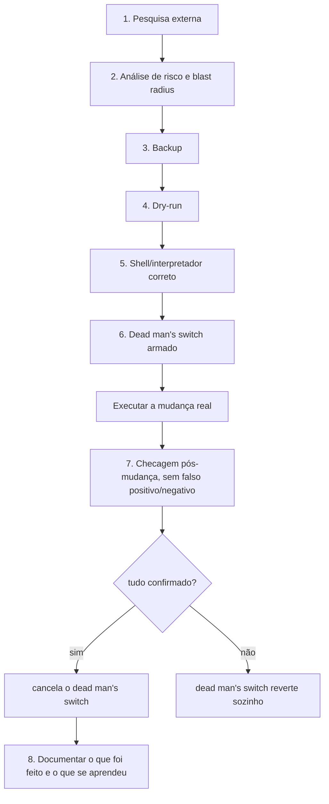
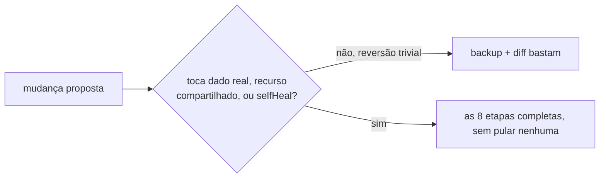

# Metodologia recomendada pra mudança e migração

**TLDR**: nenhuma mudança de risco real (migração de chart, rename de recurso, troca de mecanismo) roda direto contra produção. Sempre passa pelas mesmas 8 etapas abaixo, na ordem, cada uma com evidência concreta de que passou, não "achismo" de que deu certo.

Este documento é **how-to guide**, no sentido de [Diátaxis](../aprender/diataxis.md): passo a passo prático, pensado pra ser seguido durante a execução de uma mudança real, não pra ser lido como teoria. A explicação de por que cada etapa existe (dead man's switch, blast radius, falso positivo/negativo, idempotência) está em [Execução segura de mudança e qualidade de software](../aprender/execucao-segura-e-qualidade.md); aqui fica só o roteiro concreto, aplicado ao ferramental real deste repositório (Ansible, Argo CD, `kubectl`, Helm).

## 1. Pesquisa externa antes de decidir o plano

Antes de desenhar a mudança, procurar deliberadamente se alguém já bateu nesse problema: issue aberta no repositório da própria ferramenta, changelog/release notes da versão sendo adotada (campo removido, breaking change, comportamento de default mudou), post-mortem público ou thread de fórum sobre o mesmo tipo de operação. Ver ["Pesquisa externa antes de mudança de risco"](../aprender/execucao-segura-e-qualidade.md#pesquisa-externa-antes-de-mudanca-de-risco). Não é burocracia: nesta sessão, pesquisar o `_helpers.tpl` do chart oficial do CNPG antes de migrar confirmou de antemão que o rename de recurso (`Deployment`/`ServiceAccount`) era inevitável, não uma surpresa descoberta em produção.

## 2. Análise de risco e blast radius, por escrito

Antes de tocar em qualquer coisa, responder três perguntas, mesmo que informalmente (FMEA completo só pra mudança de blast radius alto, ver [Checklist e análise de risco](../aprender/execucao-segura-e-qualidade.md#checklist-e-analise-de-risco-antes-de-executar)):

- **O que especificamente pode dar errado?** (não "algo pode dar errado", o modo de falha nomeado: "o Namespace pode ser prunado junto", não "a migração pode falhar")
- **Qual o blast radius de cada modo de falha?** Recurso isolado e sem dependente, ou algo que outro sistema depende (produção real, secret, PVC com `ReclaimPolicy: Delete`)?
- **Existe cadeia de propriedade (`ownerReferences`) entre o que vai ser tocado e um dado real?** Confirmar via `kubectl get <recurso> -o jsonpath="{.metadata.ownerReferences}"` antes de decidir prosseguir com qualquer rename ou remoção, não depois.

## 3. Backup do estado atual, antes de qualquer comando que muda algo

Backup completo do manifesto vivo (`kubectl get <recurso> -o yaml > backup-antes.yaml`) de tudo que a mudança vai tocar, salvo fora do cluster (não só `git stash`, o cluster pode ficar inacessível). Pra CRD/operator com múltiplos recursos relacionados (Deployment, ServiceAccount, ClusterRole, webhook), backup de todos, não só do que parece mais importante.

## 4. Dry-run, sempre que a ferramenta suportar

`ansible-playbook --check`, `kubectl apply --dry-run=server`, `helm template` comparado documento a documento contra o que já está rodando (nunca diff de texto bruto, ver a técnica completa em [Argo CD, "Verificação usada antes de aplicar"](../aprender/argocd.md)), `terraform plan`. Dry-run reduz falso positivo de "vai dar certo" antes de gastar o orçamento de risco real com a mudança de verdade.

## 5. Confirmar o shell/interpretador certo antes de rodar

Antes de colar um script/heredoc pensado pra `bash` (arrays associativos, `[[ ]]`, `<()`), confirmar qual é o shell interativo de quem vai rodar. Se não for `bash`, ou não se tem certeza, invocar explicitamente `bash -c '...'`/`bash script.sh`, nunca assumir. Ver ["Confusão de shell"](../aprender/execucao-segura-e-qualidade.md#confusao-de-shell-script-escrito-pra-um-interpretador-rodando-embaixo-de-outro). Isso vale igual pra script gerado na hora quanto pra automação já existente que alguém vai rodar manualmente numa máquina diferente da que foi testada.

## 6. Armar o dead man's switch antes do primeiro comando real

Pra qualquer mudança que não seja trivialmente reversível num único `kubectl apply` do backup: `systemd-run --unit=<nome> --on-active=<janela> <comando de rollback>` armado **antes** do primeiro comando real, cancelado **só depois** da checagem da etapa 7 confirmar sucesso de verdade. Ver [Dead man's switch e blast radius](../aprender/execucao-segura-e-qualidade.md#dead-mans-switch-e-blast-radius), incluindo o achado real de que `kubectl patch`/`kubectl edit` no meio da janela armada quebra silenciosamente um switch baseado em `kubectl apply -f`; preferir `kubectl replace --force` se outra coisa vai continuar tocando o mesmo recurso durante a janela.

Se a mudança envolve `--prune` explícito: conferir no `diff` se algum recurso "só ao vivo" que não deveria ser apagado (ex.: um `Namespace` que o chart não declara) está misturado com o que a pessoa quer apagar de propósito. `--prune` não distingue os dois.

## 7. Checagem pós-mudança que não se engana

Depois de aplicar de verdade, confirmar com evidência que resiste a falso positivo e falso negativo (ver [a seção correspondente](../aprender/execucao-segura-e-qualidade.md#falso-positivo-e-falso-negativo-na-propria-verificacao)):

- `diff` vazio de verdade (`--hard-refresh`, não cache), rodado mais de uma vez se o histórico daquele recurso específico já mostrou instabilidade.
- Identidade dos recursos que não deveriam ter sido tocados: `uid`/`creationTimestamp` inalterados, prova de que nada foi recriado.
- Pra webhook/admission controller: testar o admission de verdade (criar um recurso de teste descartável que o webhook intercepta), não só olhar o pod `1/1 Running`.
- Pra dado real (banco, fila com mensagem em trânsito): confirmar saúde do recurso de dado (`Cluster in healthy state`, conexão ativa) durante e depois, não só no final.
- Varredura geral: `kubectl get pods -A | grep -v -E "Running|Completed"` vazio.

Só depois de toda essa lista confirmada, cancelar o dead man's switch da etapa 6.

## 8. Documentar o que foi feito e o que se aprendeu

Fechar a pendência correspondente em [Pendências](pendencias.md) com o resultado real (não só "feito", o que foi verificado e como). Se algo se comportou de um jeito não óbvio (comportamento implícito, ferramenta com bug conhecido, sequência que só funciona numa ordem específica), registrar como lição nova em [Aprender: Argo CD](../aprender/argocd.md) ou no documento de aprendizado equivalente pro sistema em questão, pra próxima pessoa (ou a mesma, seis meses depois) não precisar redescobrir do zero.

## Quando pular etapas é aceitável

Nem toda mudança pesa o mesmo. Uma correção de digitação em documentação não precisa de dead man's switch. O critério pra decidir quanto rigor aplicar é o mesmo da etapa 2: blast radius baixo e reversão trivial (um `git revert` sem efeito colateral) tolera pular backup/dry-run/dead man's switch; qualquer coisa que toque dado real, recurso compartilhado, ou mecanismo de reconciliação automática (`selfHeal: true`) não tolera, mesmo que pareça uma mudança pequena.

