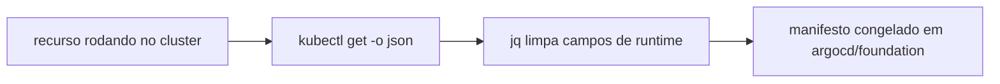
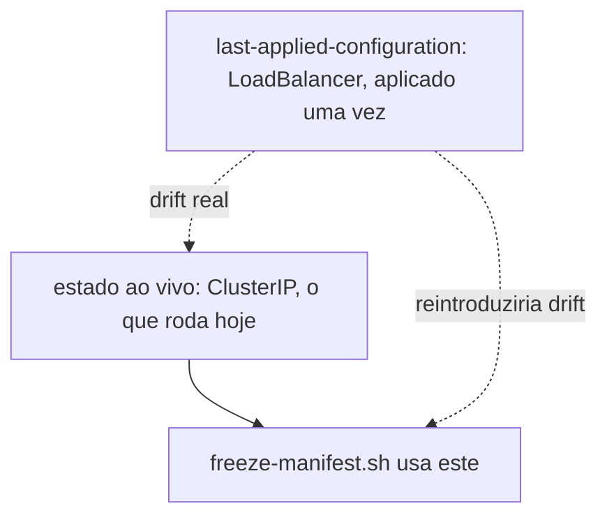

# Scripts

`scripts/freeze-manifest.sh <tipo> <nome> <namespace>` congela o manifesto atual de um recurso já rodando no cluster, via `kubectl get -o json` limpo de campos de runtime com `jq`, pra virar fonte de verdade em `argocd/foundation`. Precisa de `jq` na máquina que rodar, não `yq`: a versão do Debian tem uma sintaxe de CLI diferente da que este script assume, `jq` evita essa ambiguidade.

Usa o estado ao vivo, não a annotation `kubectl.kubernetes.io/last-applied-configuration`. Já apareceu um caso real neste cluster, o Service `redis-server` (ver [Foundation](../arquitetura/foundation.md)), onde o que foi aplicado uma vez diverge do que está rodando hoje. Congelar o `last-applied` reintroduziria essa mudança sem ninguém pedir.

Exemplo: `./freeze-manifest.sh deployment rabbitmq ladesa-ro-production`
